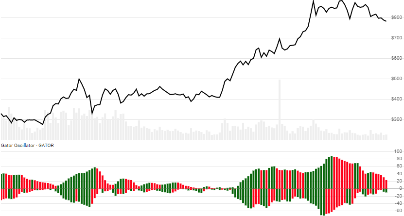

# Gator Oscillator

Created by Bill Williams, the Gator Oscillator is an expanded view of [Williams Alligator](../Alligator/README.md#content).
[[Discuss] :speech_balloon:](https://github.com/DaveSkender/Stock.Indicators/discussions/385 "Community discussion about this indicator")



```csharp
// usage
IEnumerable<GatorResult> results =
  quotes.GetGator();
```

## Historical quotes requirements

You must have at least 115 periods of `quotes`. Since this uses a smoothing technique, we recommend you use at least 265 data points prior to the intended usage date for better precision.

`quotes` is an `IEnumerable<TQuote>` collection of historical price quotes.  It should have a consistent frequency (day, hour, minute, etc).  See [the Guide](../../docs/GUIDE.md#historical-quotes) for more information.

## Response

```csharp
IEnumerable<GatorResult>
```

The first 10-20 periods will have `null` values since there's not enough data to calculate.  We always return the same number of elements as there are in the historical quotes.

:warning: **Warning**: The first 150 periods will have decreasing magnitude, convergence-related precision errors that can be as high as ~5% deviation in indicator values for earlier periods.

### GatorResult

| name | type | notes
| -- |-- |--
| `Date` | DateTime | Date
| `Upper` | decimal | Absolute value of Alligator `Jaw-Teeth`
| `Lower` | decimal | Absolute value of Alligator `Lips-Teeth`
| `UpperIsExpanding` | boolean | Upper value is growing
| `LowerIsExpanding` | boolean | Lower value is growing

### Utilities

- [.Find(lookupDate)](../../docs/UTILITIES.md#find-indicator-result-by-date)
- [.RemoveWarmupPeriods()](../../docs/UTILITIES.md#remove-warmup-periods)
- [.RemoveWarmupPeriods(qty)](../../docs/UTILITIES.md#remove-warmup-periods)

See [Utilities and Helpers](../../docs/UTILITIES.md#content) for more information.

## Example

```csharp
// fetch historical quotes from your feed (your method)
IEnumerable<Quote> quotes = GetHistoryFromFeed("MSFT");

// calculate the Gator Oscillator
IEnumerable<GatorResult> results = quotes.GetGator();
```
