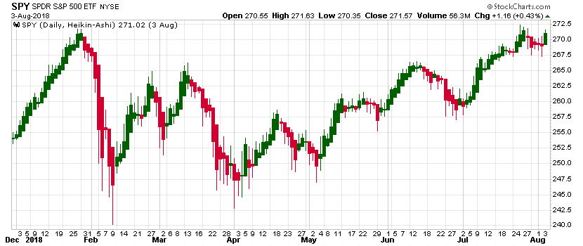

# Heikin-Ashi

Created by Munehisa Homma, [Heikin-Ashi](https://en.wikipedia.org/wiki/Candlestick_chart#Heikin-Ashi_candlesticks) is a modified candlestick pattern that uses prior day for smoothing.
[[Discuss] :speech_balloon:](https://github.com/DaveSkender/Stock.Indicators/discussions/254 "Community discussion about this indicator")



```csharp
// usage
IEnumerable<HeikinAshiResult> results =
  history.GetHeikinAshi();  
```

## Historical quotes requirements

You must have at least two periods of `history`; however, more is typically provided since this is a chartable candlestick pattern.

`history` is an `IEnumerable<TQuote>` collection of historical price quotes.  It should have a consistent frequency (day, hour, minute, etc).  See [the Guide](../../docs/GUIDE.md) for more information.

## Response

```csharp
IEnumerable<HeikinAshiResult>
```

The first period will have `null` values since there's not enough data to calculate.  We always return the same number of elements as there are in the historical quotes.

### HeikinAshiResult

| name | type | notes
| -- |-- |--
| `Date` | DateTime | Date
| `Open` | decimal | Modified open price
| `High` | decimal | Modified high price
| `Low` | decimal | Modified low price
| `Close` | decimal | Modified close price

## Example

```csharp
// fetch historical quotes from your feed (your method)
IEnumerable<Quote> history = GetHistoryFromFeed("MSFT");

// calculate
IEnumerable<HeikinAshiResult> results = history.GetHeikinAshi();

// use results as needed
HeikinAshiResult result = results.LastOrDefault();
Console.WriteLine("Heikin-Ashi open price on {0} was ${1}", result.Date, result.Open);
```

```bash
Heikin-Ashi open price on 12/31/2018 was $241.3
```
