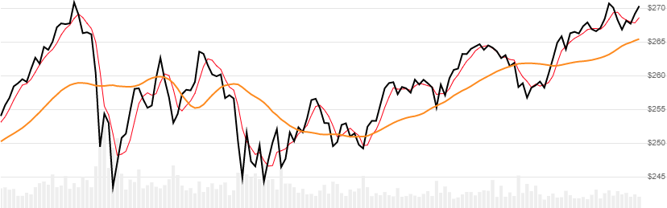

# Hilbert Transform Instantaneous Trendline

Created by John Ehlers, the Hilbert Transform Instantaneous Trendline is a 5-period trendline of high/low price that uses signal processing to reduce noise.
[[Discuss] :speech_balloon:](https://github.com/DaveSkender/Stock.Indicators/discussions/363 "Community discussion about this indicator")



```csharp
// usage
IEnumerable<HtlResult> results = Indicator.GetHtTrendline(history);
```

## Parameters

| name | type | notes
| -- |-- |--
| `history` | IEnumerable\<[TQuote](../../docs/GUIDE.md#historical-quotes)\> | Historical price quotes should have a consistent frequency (day, hour, minute, etc).

### Minimum history requirements

Since this indicator has a warmup period, you must supply at least `100` periods of `history`.

## Response

```csharp
IEnumerable<HtlResult>
```

The first `6` periods will have `null` values `SmoothPrice` since there's not enough data to calculate.  We always return the same number of elements as there are in the historical quotes.

:warning: **Warning**: The first `100` periods will have decreasing magnitude, convergence-related precision errors that can be as high as ~5% deviation in indicator values for earlier periods.

### HtlResult

| name | type | notes
| -- |-- |--
| `Date` | DateTime | Date
| `Trendline` | decimal | HT Trendline
| `SmoothPrice` | decimal | Weighted moving average of `(H+L)/2` price

## Example

```csharp
// fetch historical quotes from your favorite feed, in Quote format
IEnumerable<Quote> history = GetHistoryFromFeed("MSFT");

// calculate HT Trendline
IEnumerable<HtlResult> results = Indicator.GetHtTrendline(history);

// use results as needed
HtlResult result = results.LastOrDefault();
Console.WriteLine("HTL on {0} was ${1}", result.Date, result.Trendline);
```

```bash
HTL on 12/31/2018 was $242.34
```
