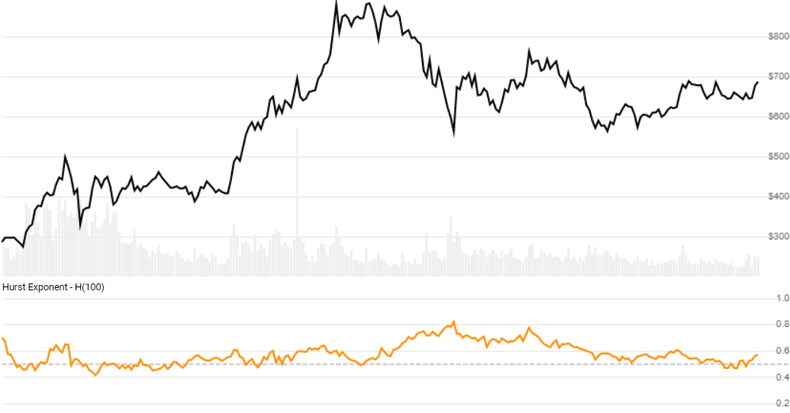

# Hurst Exponent

The [Hurst Exponent](https://en.wikipedia.org/wiki/Hurst_exponent) is TBD.
[[Discuss] :speech_balloon:](https://github.com/DaveSkender/Stock.Indicators/discussions/477 "Community discussion about this indicator")



```csharp
// usage
IEnumerable<HurstResult> results =
  quotes.GetHurst(lookbackPeriods);  
```

## Parameters

| name | type | notes
| -- |-- |--
| `lookbackPeriods` | int | Number of periods (`N`) in the moving average.  Must be greater than 0.  Default is 20.

### Historical quotes requirements

You must have at least `N+1` periods of `quotes`.

`quotes` is an `IEnumerable<TQuote>` collection of historical price quotes.  It should have a consistent frequency (day, hour, minute, etc).  See [the Guide](../../docs/GUIDE.md#historical-quotes) for more information.

## Response

```csharp
IEnumerable<HurstResult>
```

The first `N-1` periods will have `null` values since there's not enough data to calculate.  We always return the same number of elements as there are in the historical quotes.

### HurstResult

| name | type | notes
| -- |-- |--
| `Date` | DateTime | Date
| `Hurst` | decimal | Hurst Exponent

### Utilities

- [.Find(lookupDate)](../../docs/UTILITIES.md#find-indicator-result-by-date)
- [.RemoveWarmupPeriods()](../../docs/UTILITIES.md#remove-warmup-periods)
- [.RemoveWarmupPeriods(qty)](../../docs/UTILITIES.md#remove-warmup-periods)

See [Utilities and Helpers](../../docs/UTILITIES.md#content) for more information.

## Example

```csharp
// fetch historical quotes from your feed (your method)
IEnumerable<Quote> quotes = GetHistoryFromFeed("SPY");

// calculate 20-period Hurst
IEnumerable<HurstResult> results = quotes.GetHurst(20);

// use results as needed
HurstResult result = results.LastOrDefault();
Console.WriteLine("Hurst on {0} was {1}", result.Date, result.Hurst);
```

```bash
Hurst on 12/31/2018 was 0.1234
```
