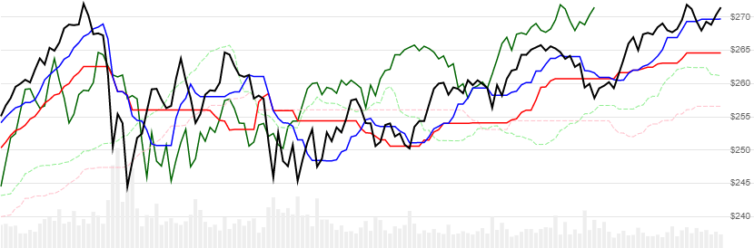

# Ichimoku Cloud

Created by Goichi Hosoda (細田悟一, Hosoda Goichi), [Ichimoku Cloud](https://en.wikipedia.org/wiki/Ichimoku_Kink%C5%8D_Hy%C5%8D), also known as Ichimoku Kinkō Hyō, is a collection of indicators that depict support and resistance, momentum, and trend direction.
[[Discuss] :speech_balloon:](https://github.com/DaveSkender/Stock.Indicators/discussions/251 "Community discussion about this indicator")



```csharp
// usage
IEnumerable<IchimokuResult> results =
  history.GetIchimoku(signalPeriod, shortSpanPeriod, longSpanPeriod);  
```

## Parameters

| name | type | notes
| -- |-- |--
| `signalPeriod` | int | Number of periods (`N`) in the Tenkan-sen midpoint evaluation.  Must be greater than 0.  Default is 9.
| `shortSpanPeriod` | int | Number of periods (`S`) in the shorter Kijun-sen midpoint evaluation.  It also sets the Chikou span lag/shift.  Must be greater than 0.  Default is 26.
| `longSpanPeriod` | int | Number of periods (`L`) in the longer Senkou leading span B midpoint evaluation.  Must be greater than `S`.  Default is 52.

### Historical quotes requirements

You must have at least the greater of `N`,`S`, or `L` periods of `history`; though, given the leading and lagging nature, we recommend notably more.

`history` is an `IEnumerable<TQuote>` collection of historical price quotes.  It should have a consistent frequency (day, hour, minute, etc).  See [the Guide](../../docs/GUIDE.md) for more information.

## Response

```csharp
IEnumerable<IchimokuResult>
```

The first `N-1`, `S-1`, and `L-1` periods will have various `null` values since there's not enough data to calculate.  We always return the same number of elements as there are in the historical quotes.

### IchimokuResult

| name | type | notes
| -- |-- |--
| `Date` | DateTime | Date
| `TenkanSen` | decimal | Conversion / signal line
| `KijunSen` | decimal | Base line
| `SenkouSpanA` | decimal | Leading span A
| `SenkouSpanB` | decimal | Leading span B
| `ChikouSpan` | decimal | Lagging span

## Example

```csharp
// fetch historical quotes from your feed (your method)
IEnumerable<Quote> history = GetHistoryFromFeed("MSFT");

// calculate ICHIMOKU(9,26,52)
IEnumerable<IchimokuResult> results =
  history.GetIchimoku(9,26,52);

// use results as needed
IchimokuResult result = results.LastOrDefault();
Console.WriteLine("Tenkan-sen on {0} was ${1}", result.Date, result.TenkanSen);
```

```bash
Tenkan-sen on 12/31/2018 was $241.26
```
