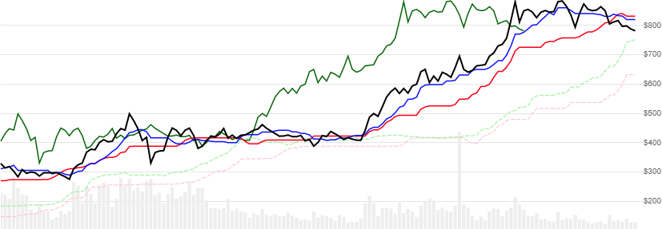

# Ichimoku Cloud

The Ichimoku Cloud, also known as Ichimoku Kinkō Hyō, is a collection of indicators that depict support and resistance, momentum, and trend direction.
[More info ...](https://school.stockcharts.com/doku.php?id=technical_indicators:ichimoku_cloud)



```csharp
// usage
IEnumerable<IchimokuResult> results = Indicator.GetIchimoku(history, lookbackPeriod);  
```

## Parameters

| name | type | notes
| -- |-- |--
| `history` | IEnumerable\<[Quote](../../docs/GUIDE.md#quote)\> | Historical Quotes data should be at any consistent frequency (day, hour, minute, etc).  You must supply at least the maximum of `N` or `S` or `L` periods of `history`; though, given the leading and lagging nature, we recommend notably more.
| `signalPeriod` | int | Number of periods (`N`) in the Tenkan-sen midpoint evaluation.  Must be greater than 0.  Default is 9.
| `shortSpanPeriod` | int | Number of periods (`S`) in the shorter Kijun-sen midpoint evaluation.  It also sets the Chikou span lag/shift.  Must be greater than 0.  Default is 26.
| `longSpanPeriod` | int | Number of periods (`L`) in the longer Senkou leading span B midpoint evaluation.  Must be greater than `S`.  Default is 52.

## Response

```csharp
IEnumerable<IchimokuResult>
```

The first `N-1`, `S-1`, and `L-1` periods will have various `null` values since there's not enough data to calculate.  We always return the same number of elements as there are in the historical quotes.

### IchimokuResult

| name | type | notes
| -- |-- |--
| `Date` | DateTime | Date
| `TenkanSen` | decimal | Conversion / signal line
| `KijunSen` | decimal | Base line
| `SenkouSpanA` | decimal | Leading span A
| `SenkouSpanB` | decimal | Leading span B
| `ChikouSpan` | decimal | Lagging span

## Example

```csharp
// fetch historical quotes from your favorite feed, in Quote format
IEnumerable<Quote> history = GetHistoryFromFeed("MSFT");

// calculate ICHIMOKU(9,26,52)
IEnumerable<IchimokuResult> results = Indicator.GetIchimoku(history,9,26,52);

// use results as needed
DateTime evalDate = DateTime.Parse("12/31/2018");
IchimokuResult result = results.Where(x=>x.Date==evalDate).FirstOrDefault();
Console.WriteLine("Tenkan-sen on {0} was ${1}", result.Date, result.TenkanSen);
```

```bash
Tenkan-sen on 12/31/2018 was $241.26
```
