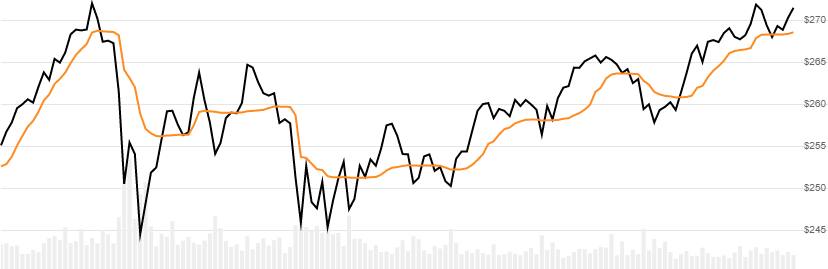

# Kaufman's Adaptive Moving Average (KAMA)

Created by Perry Kaufman, [KAMA](https://school.stockcharts.com/doku.php?id=technical_indicators:kaufman_s_adaptive_moving_average) is an volatility adaptive moving average of Close price over configurable lookback periods.
[[Discuss] :speech_balloon:](https://github.com/DaveSkender/Stock.Indicators/discussions/210 "Community discussion about this indicator")



```csharp
// usage
IEnumerable<KamaResult> results =
  history.GetKama(erPeriod, fastPeriod, slowPeriod);  
```

## Parameters

| name | type | notes
| -- |-- |--
| `erPeriod` | int | Number of Efficiency Ratio (volatility) periods (`E`).  Must be greater than 0.  Default is 10.
| `fastPeriod` | int | Number of Fast EMA periods.  Must be greater than 0.  Default is 2.
| `slowPeriod` | int | Number of Slow EMA periods.  Must be greater than `fastPeriod`.  Default is 30.

### Historical quotes requirements

You must have at least `6×E` or `E+100` periods of `history`, whichever is more.  Since this uses a smoothing technique, we recommend you use at least `10×E` data points prior to the intended usage date for better precision.

`history` is an `IEnumerable<TQuote>` collection of historical price quotes.  It should have a consistent frequency (day, hour, minute, etc).  See [the Guide](../../docs/GUIDE.md) for more information.

## Response

```csharp
IEnumerable<KamaResult>
```

The first `N-1` periods will have `null` values since there's not enough data to calculate.  We always return the same number of elements as there are in the historical quotes.

:warning: **Warning**: The first `10×E` periods will have decreasing magnitude, convergence-related precision errors that can be as high as ~5% deviation in indicator values for earlier periods.

### KamaResult

| name | type | notes
| -- |-- |--
| `Date` | DateTime | Date
| `ER`   | decimal | Efficiency Ratio is the fractal efficiency of price changes
| `Kama` | decimal | Kaufman's adaptive moving average

More about Efficiency Ratio: ER fluctuates between 0 and 1, but these extremes are the exception, not the norm. ER would be 1 if prices moved up or down consistently over the `erPeriod` periods. ER would be zero if prices are unchanged over the `erPeriod` periods.

## Example

```csharp
// fetch historical quotes from your feed (your method)
IEnumerable<Quote> history = GetHistoryFromFeed("MSFT");

// calculate KAMA(10,2,30)
IEnumerable<KamaResult> results = history.GetKama(10,2,30);

// use results as needed
KamaResult result = results.LastOrDefault();
Console.WriteLine("KAMA on {0} was ${1}", result.Date, result.Kama);
```

```bash
KAMA on 12/31/2018 was $251.86
```
