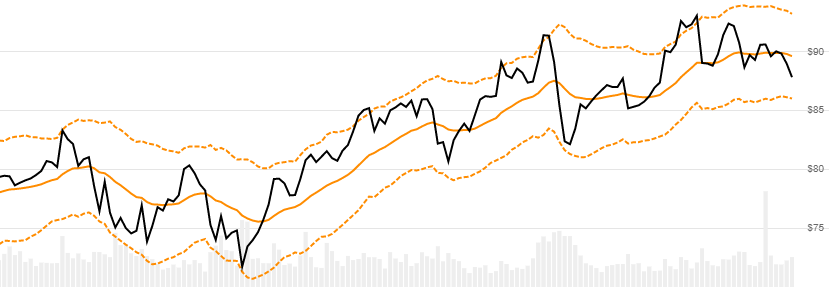

# Keltner Channels

Created by Chester W. Keltner, [Keltner Channels](https://en.wikipedia.org/wiki/Keltner_channel) are based on an EMA centerline and ATR band widths.  See also [STARC Bands](../StarcBands/README.md#content) for an SMA centerline equivalent.
[[Discuss] :speech_balloon:](https://github.com/DaveSkender/Stock.Indicators/discussions/249 "Community discussion about this indicator")



```csharp
// usage
IEnumerable<KeltnerResult> results = Indicator.GetKeltner(history, emaPeriod, multiplier, atrPeriod);  
```

## Parameters

| name | type | notes
| -- |-- |--
| `history` | IEnumerable\<[TQuote](../../docs/GUIDE.md#historical-quotes)\> | Historical price quotes should have a consistent frequency (day, hour, minute, etc).
| `emaPeriod` | int | Number of lookback periods (`E`) for the center line moving average.  Must be greater than 1 to calculate.  Default is 20.
| `multiplier` | decimal | ATR Multiplier. Must be greater than 0.  Default is 2.
| `atrPeriod` | int | Number of lookback periods (`A`) for the Average True Range.  Must be greater than 1 to calculate.  Default is 10.

### Minimum history requirements

You must supply at least `2×N` or `N+100` periods of `history`, whichever is more, where `N` is the greater of `E` or `A` periods.  Since this uses a smoothing technique, we recommend you use at least `N+250` data points prior to the intended usage date for better precision.

## Response

```csharp
IEnumerable<KeltnerResult>
```

The first `N-1` periods will have `null` values since there's not enough data to calculate.  We always return the same number of elements as there are in the historical quotes.

:warning: **Warning**: The first `N+250` periods will have decreasing magnitude, convergence-related precision errors that can be as high as ~5% deviation in indicator values for earlier periods.

### KeltnerResult

| name | type | notes
| -- |-- |--
| `Date` | DateTime | Date
| `UpperBand` | decimal | Upper band of Keltner Channel
| `Centerline` | decimal | EMA of Close price
| `LowerBand` | decimal | Lower band of Keltner Channel
| `Width` | decimal | Width as percent of Centerline price.  `(UpperBand-LowerBand)/Centerline`

## Example

```csharp
// fetch historical quotes from your favorite feed, in Quote format
IEnumerable<Quote> history = GetHistoryFromFeed("SPY");

// calculate Keltner(20)
IEnumerable<KeltnerResult> results = Indicator.GetKeltner(history,20,2.0,10);

// use results as needed
KeltnerResult result = results.LastOrDefault();
Console.WriteLine("Upper Keltner Channel on {0} was ${1}", result.Date, result.UpperBand);
```

```bash
Upper Keltner Channel on 12/31/2018 was $262.19
```
