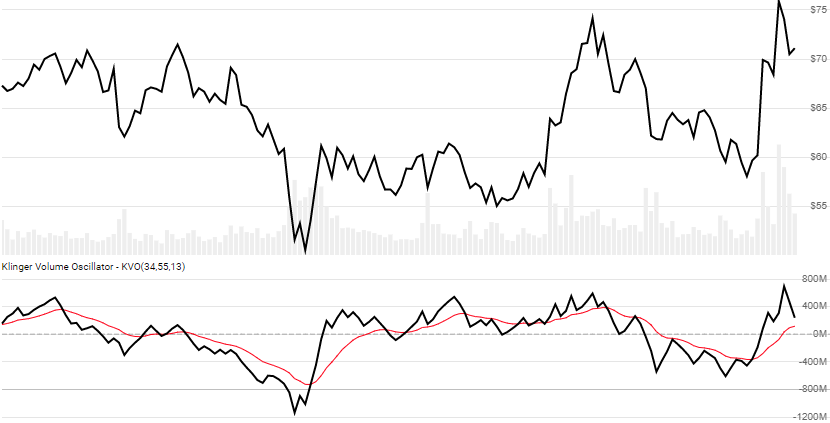

# Klinger Volume Oscillator

Created by Stephen Klinger, the [Klinger Volume Oscillator](https://www.investopedia.com/terms/k/klingeroscillator.asp) depicts volume-based trend reversal and divergence between short and long-term money flow.
[[Discuss] :speech_balloon:](https://github.com/DaveSkender/Stock.Indicators/discussions/446 "Community discussion about this indicator")



```csharp
// usage
IEnumerable<KvoResult> results = 
  history.GetKvo(shortPeriod, longPeriod, signalPeriod);  
```

## Parameters

| name | type | notes
| -- |-- |--
| `fastPeriod` | int | Number of lookback periods (`F`) for the short-term EMA.  Must be greater than 2.  Default is 34.
| `slowPeriod` | int | Number of lookback periods (`L`) for the long-term EMA.  Must be greater than `F`.  Default is 55.
| `signalPeriod` | int | Number of lookback periods for the signal line.  Must be greater than 0.  Default is 13.

### Historical quotes requirements

You must have at least `L+100` periods of `history`.  Since this uses a smoothing technique, we recommend you use at least `L+150` data points prior to the intended usage date for better precision.

`history` is an `IEnumerable<TQuote>` collection of historical price quotes.  It should have a consistent frequency (day, hour, minute, etc).  See [the Guide](../../docs/GUIDE.md) for more information.

## Response

```csharp
IEnumerable<KvoResult>
```

The first `L+1` periods will have `null` values since there's not enough data to calculate.  We always return the same number of elements as there are in the historical quotes.

:warning: **Warning**: The first `L+100` periods will have decreasing magnitude, convergence-related precision errors that can be as high as ~5% deviation in indicator values for earlier periods.

### KvoResult

| name | type | notes
| -- |-- |--
| `Date` | DateTime | Date
| `Oscillator` | decimal | Klinger Oscillator
| `Signal` | decimal | EMA of Klinger Oscillator (signal line)

## Example

```csharp
// fetch historical quotes from your feed (your method)
IEnumerable<Quote> history = GetHistoryFromFeed("SPY");

// calculate Klinger(34,55,13)
IEnumerable<KvoResult> results = history.GetKvo(34,55,13);

// use results as needed
KvoResult result = results.LastOrDefault();
Console.WriteLine("Klinger Oscillator on {0} was {1:N0}", result.Date, result.Oscillator);
```

```bash
Klinger Oscillator on 12/31/2018 was -539,224,047
```
