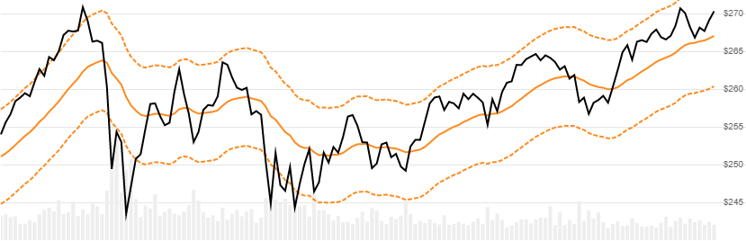

# Moving Average Envelopes

[Moving Average Envelopes](https://en.wikipedia.org/wiki/Moving_average_envelope) is a price band overlay that is offset from the moving average of Close price over a lookback window.
[[Discuss] :speech_balloon:](https://github.com/DaveSkender/Stock.Indicators/discussions/288 "Community discussion about this indicator")



```csharp
// usage
IEnumerable<MaEnvelopeResult> results =
  quotes.GetSmaEnvelopes(lookbackPeriods, percentOffset, movingAverageType);  
```

## Parameters

| name | type | notes
| -- |-- |--
| `lookbackPeriods` | int | Number of periods (`N`) in the moving average.  Must be greater than 1.
| `percentOffset` | double | Percent offset for envelope width.  Example: 3.5% would be entered as 3.5 (not 0.035).  Must be greater than 0.  Typical values range from 2 to 10.  Default is 2.5.
| `movingAverageType` | MaType | Type of moving average (e.g. SMA, EMA, HMA).  See [MaType options](#matype-options) below.  Default is `MaType.SMA`.

### Historical quotes requirements

See links in the supported [MaType options](#matype-options) section below for details on the inherited requirements for `quotes` and `lookbackPeriods`.

`quotes` is an `IEnumerable<TQuote>` collection of historical price quotes.  It should have a consistent frequency (day, hour, minute, etc).  See [the Guide](../../docs/GUIDE.md#historical-quotes) for more information.

### MaType options

These are the supported moving average types:

| type | description
|-- |--
| `MaType.ALMA` | [Arnaud Legoux Moving Average](../Alma/README.md#content)
| `MaType.DEMA` | [Double Exponential Moving Average](../Ema/README.md#content)
| `MaType.EPMA` | [Endpoint Moving Average](../Epma/README.md#content)
| `MaType.EMA` | [Exponential Moving Average](../Ema/README.md#content)
| `MaType.HMA` | [Hull Moving Average](../Hma/README.md#content)
| `MaType.SMA` | [Simple Moving Average](../Sma/README.md#content) (default)
| `MaType.TEMA` | [Triple Exponential Moving Average](../Ema/README.md#content)
| `MaType.WMA` | [Weighted Moving Average](../Wma/README.md#content)

:warning: For ALMA, default values are used for `offset` and `sigma`.

## Response

```csharp
IEnumerable<MaEnvelopeResult>
```

- This method returns a time series of all available indicator values for the `quotes` provided.
- It always returns the same number of elements as there are in the historical quotes.
- It does not return a single incremental indicator value.
- The first periods will have `null` values since there's not enough data to calculate; the quantity will vary based on the `movingAverageType` specified.

:warning: Some moving average variants have decreasing magnitude, convergence-related precision errors that can be as high as ~5% deviation in indicator values for earlier periods.  See links in the supported [MaType options](#matype-options) section above for more information.

### MaEnvelopeResult

| name | type | notes
| -- |-- |--
| `Date` | DateTime | Date
| `Centerline` | decimal | Moving average for `N` lookback periods
| `UpperEnvelope` | decimal | Upper envelope band
| `LowerEnvelope` | decimal | Lower envelope band

The moving average `Centerline` is based on the `movingAverageType` type specified.

### Utilities

- [.Find(lookupDate)](../../docs/UTILITIES.md#find-indicator-result-by-date)
- [.RemoveWarmupPeriods(qty)](../../docs/UTILITIES.md#remove-warmup-periods)

See [Utilities and Helpers](../../docs/UTILITIES.md#content) for more information.

## Example

```csharp
// fetch historical quotes from your feed (your method)
IEnumerable<Quote> quotes = GetHistoryFromFeed("MSFT");

// calculate 20-period SMA envelopes with 2.5% offset
IEnumerable<MaEnvelopeResult> results = 
    quotes.GetMaEnvelopes(20,2.5,MaType.SMA);
```
