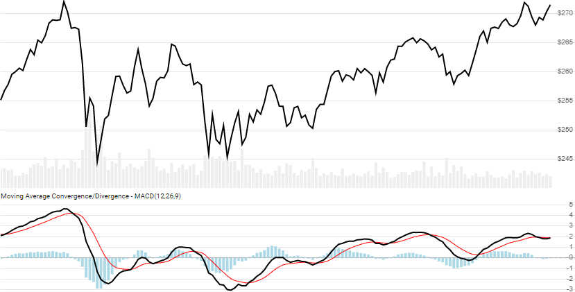

# Moving Average Convergence/Divergence (MACD)

Created by Gerald Appel, [MACD](https://en.wikipedia.org/wiki/MACD) is a simple oscillator view of two converging/diverging exponential moving averages.
[[Discuss] :speech_balloon:](https://github.com/DaveSkender/Stock.Indicators/discussions/248 "Community discussion about this indicator")



```csharp
// usage
IEnumerable<MacdResult> results =
  Indicator.GetMacd(history, fastPeriod, slowPeriod, signalPeriod);  
```

## Parameters

| name | type | notes
| -- |-- |--
| `history` | IEnumerable\<[TQuote](../../docs/GUIDE.md#historical-quotes)\> | Historical price quotes should have a consistent frequency (day, hour, minute, etc).
| `fastPeriod` | int | Number of periods (`F`) for the faster moving average.  Must be greater than 0.  Default is 12.
| `slowPeriod` | int | Number of periods (`S`) for the slower moving average.  Must be greater than `fastPeriod`.  Default is 26.
| `signalPeriod` | int | Number of periods (`P`) for the moving average of MACD.  Must be greater than or equal to 0.  Default is 9.

### Minimum history requirements

You must supply at least `2×(S+P)` or `S+P+100` worth of `history`, whichever is more.  Since this uses a smoothing technique, we recommend you use at least `S+P+250` data points prior to the intended usage date for better precision.

## Response

```csharp
IEnumerable<MacdResult>
```

The first `S-1` slow periods will have `null` values since there's not enough data to calculate.  We always return the same number of elements as there are in the historical quotes.

:warning: **Warning**: The first `S+P+250` periods will have decreasing magnitude, convergence-related precision errors that can be as high as ~5% deviation in indicator values for earlier periods.

### MacdResult

| name | type | notes
| -- |-- |--
| `Date` | DateTime | Date
| `Macd` | decimal | The MACD line is the difference between slow and fast moving averages
| `Signal` | decimal | Moving average of the `MACD` line
| `Histogram` | decimal | Gap between of the `MACD` and `Signal` line

## Example

```csharp
// fetch historical quotes from your favorite feed, in Quote format
IEnumerable<Quote> history = GetHistoryFromFeed("SPY");

// calculate MACD(12,26,9)
IEnumerable<MacdResult> results = Indicator.GetMacd(history,12,26,9);

// use results as needed
MacdResult result = results.LastOrDefault();
Console.WriteLine("MACD on {0} was {1}", result.Date, result.Macd);
```

```bash
MACD on 12/31/2018 was -6.22
```
