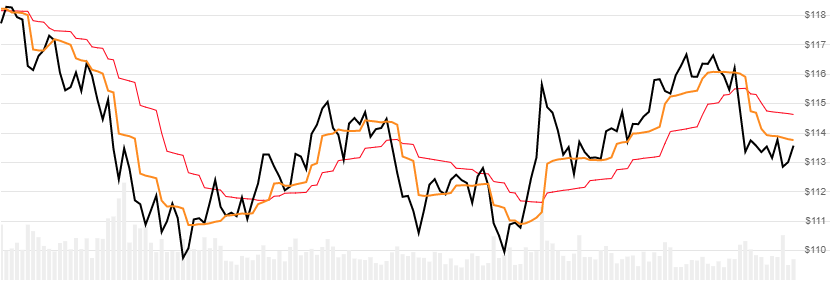

# MESA Adaptive Moving Average (MAMA)

Created by John Ehlers, the [MAMA](http://mesasoftware.com/papers/MAMA.pdf) indicator is a 5-period adaptive moving average of high/low price.
[[Discuss] :speech_balloon:](https://github.com/DaveSkender/Stock.Indicators/discussions/211 "Community discussion about this indicator")



```csharp
// usage
IEnumerable<MamaResult> results = Indicator.GetMama(history, fastLimit, slowLimit);  
```

## Parameters

| name | type | notes
| -- |-- |--
| `history` | IEnumerable\<[TQuote](../../docs/GUIDE.md#historical-quotes)\> | Historical price quotes should have a consistent frequency (day, hour, minute, etc).
| `fastLimit` | decimal | Fast limit threshold.  Must be greater than `slowLimit` and less than 1.  Default is 0.5.
| `slowLimit` | decimal | Slow limit threshold.  Must be greater than 0.  Default is 0.05.

### Minimum history requirements

Since this indicator has a warmup period, you must supply at least `50` periods of `history`.

## Response

```csharp
IEnumerable<MamaResult>
```

The first `5` periods will have `null` values for MAMA since there's not enough data to calculate.  We always return the same number of elements as there are in the historical quotes.

:warning: **Warning**: The first `50` periods will have decreasing magnitude, convergence-related precision errors that can be as high as ~5% deviation in indicator values for earlier periods.

### MamaResult

| name | type | notes
| -- |-- |--
| `Date` | DateTime | Date
| `Mama` | decimal | MESA adaptive moving average (MAMA)
| `Fama` | decimal | Following adaptive moving average (FAMA)

## Example

```csharp
// fetch historical quotes from your favorite feed, in Quote format
IEnumerable<Quote> history = GetHistoryFromFeed("MSFT");

// calculate Mama(0.5,0.05)
IEnumerable<MamaResult> results = Indicator.GetMama(history,0.5,0.05);

// use results as needed
MamaResult result = results.LastOrDefault();
Console.WriteLine("MAMA on {0} was ${1}", result.Date, result.Mama);
```

```bash
MAMA on 12/31/2018 was $251.86
```
