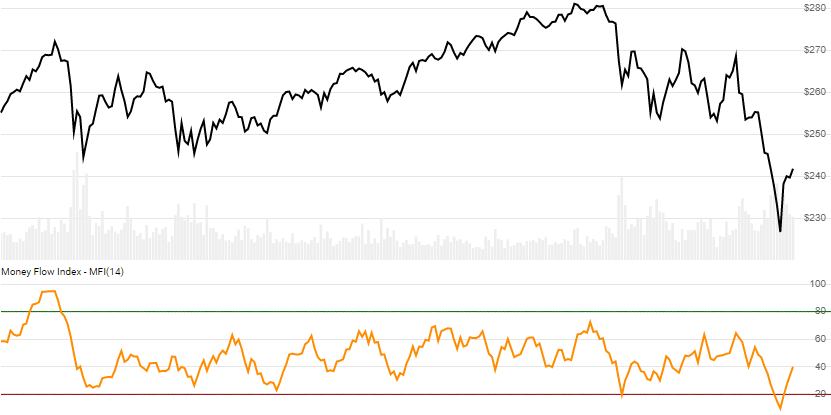

# Money Flow Index (MFI)

Created by Quong and Soudack, the [Money Flow Index](https://en.wikipedia.org/wiki/Money_flow_index) is a price-volume oscillator that shows buying and selling momentum.
[[Discuss] :speech_balloon:](https://github.com/DaveSkender/Stock.Indicators/discussions/247 "Community discussion about this indicator")



```csharp
// usage
IEnumerable<MfiResult> results =
  history.GetMfi(lookbackPeriod);
```

## Parameters

| name | type | notes
| -- |-- |--
| `lookbackPeriod` | int | Number of periods (`N`) in the lookback period.  Must be greater than 1. Default is 14.

### Historical quotes requirements

You must have at least `N+1` historical quotes.

`history` is an `IEnumerable<TQuote>` collection of historical price quotes.  It should have a consistent frequency (day, hour, minute, etc).  See [the Guide](../../docs/GUIDE.md) for more information.

## Response

```csharp
IEnumerable<MfiResult>
```

The first `N` periods will have `null` MFI values since they cannot be calculated.  We always return the same number of elements as there are in the historical quotes.

### MfiResult

| name | type | notes
| -- |-- |--
| `Date` | DateTime | Date
| `Mfi` | decimal | Money Flow Index

## Example

```csharp
// fetch historical quotes from your feed (your method)
IEnumerable<Quote> history = GetHistoryFromFeed("SPY");

// calculate
IEnumerable<MfiResult> results = history.GetMfi(14);

// use results as needed
MfiResult result = results.LastOrDefault();
Console.WriteLine("MFI on {0} was {1}", result.Date, result.Mfi);
```

```bash
MFI on 12/31/2018 was 39.95
```
