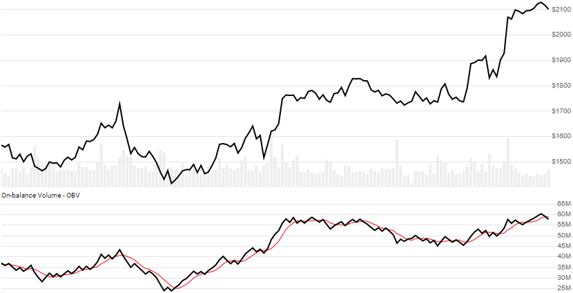

# On-Balance Volume (OBV)

Popularized by Joseph Granville, [On-balance Volume](https://en.wikipedia.org/wiki/On-balance_volume) is a rolling accumulation of volume based on Close price direction.
[[Discuss] :speech_balloon:](https://github.com/DaveSkender/Stock.Indicators/discussions/246 "Community discussion about this indicator")



```csharp
// usage
IEnumerable<ObvResult> results =
  quotes.GetObv();

// usage with optional overlay SMA of OBV (shown above)
IEnumerable<ObvResult> results =
  quotes.GetObv(smaPeriods);  
```

## Parameters

| name | type | notes
| -- |-- |--
| `smaPeriods` | int | Optional.  Number of periods (`N`) in the moving average of OBV.  Must be greater than 0, if specified.

### Historical quotes requirements

You must have at least two historical quotes; however, since this is a trendline, more is recommended.

`quotes` is an `IEnumerable<TQuote>` collection of historical price quotes.  It should have a consistent frequency (day, hour, minute, etc).  See [the Guide](../../docs/GUIDE.md#historical-quotes) for more information.

## Response

```csharp
IEnumerable<ObvResult>
```

The first period OBV will have `0` value since there's not enough data to calculate.  We always return the same number of elements as there are in the historical quotes.

### ObvResult

| name | type | notes
| -- |-- |--
| `Date` | DateTime | Date
| `Obv` | decimal | On-balance Volume
| `ObvSma` | decimal | Moving average (SMA) of OBV based on `smaPeriods` periods, if specified

:warning: **Warning**: absolute values in OBV are somewhat meaningless, so use with caution.

### Utilities

- [.ConvertToQuotes()](../../docs/UTILITIES.md#convert-to-quotes)
- [.Find(lookupDate)](../../docs/UTILITIES.md#find-indicator-result-by-date)
- [.RemoveWarmupPeriods(qty)](../../docs/UTILITIES.md#remove-warmup-periods)

See [Utilities and Helpers](../../docs/UTILITIES.md#content) for more information.

## Example

```csharp
// fetch historical quotes from your feed (your method)
IEnumerable<Quote> quotes = GetHistoryFromFeed("SPY");

// calculate
IEnumerable<ObvResult> results = quotes.GetObv();
```
