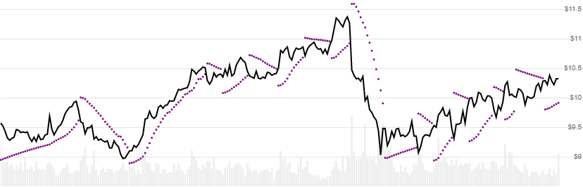

# Parabolic SAR (stop and reverse)

Created by J. Welles Wilder, [Parabolic SAR](https://en.wikipedia.org/wiki/Parabolic_SAR) (stop and reverse) is a price-time based indicator used to determine trend direction and reversals.
[[Discuss] :speech_balloon:](https://github.com/DaveSkender/Stock.Indicators/discussions/245 "Community discussion about this indicator")



```csharp
// usage
IEnumerable<ParabolicSarResult> results =
  history.GetParabolicSar(accelerationStep, maxAccelerationFactor);  
```

## Parameters

| name | type | notes
| -- |-- |--
| `accelerationStep` | decimal | Incremental step size.  Must be greater than 0.  Default is 0.02
| `maxAccelerationFactor` | decimal | Maximimum step limit.  Must be greater than `accelerationStep`.  Default is 0.2

### Historical quotes requirements

At least two history records are required to calculate; however, we recommend at least 100 data points.  Initial Parabolic SAR values prior to the first reversal are not accurate and are excluded from the results.  Therefore, provide sufficient history to capture prior trend reversals, before your intended usage period.

`history` is an `IEnumerable<TQuote>` collection of historical price quotes.  It should have a consistent frequency (day, hour, minute, etc).  See [the Guide](../../docs/GUIDE.md) for more information.

## Response

```csharp
IEnumerable<ParabolicSarResult>
```

The first trend will have `null` values since it is not accurate and based on an initial guess.  We always return the same number of elements as there are in the historical quotes.

### ParabolicSarResult

| name | type | notes
| -- |-- |--
| `Date` | DateTime | Date
| `Sar` | decimal | Stop and Reverse value
| `IsReversal` | bool | Indicates a trend reversal

## Example

```csharp
// fetch historical quotes from your feed (your method)
IEnumerable<Quote> history = GetHistoryFromFeed("SPY");

// calculate ParabolicSar(0.02,0.2)
IEnumerable<ParabolicSarResult> results = history.GetParabolicSar(0.02,0.2);

// use results as needed
ParabolicSarResult result = results.LastOrDefault();
Console.WriteLine("SAR on {0} was ${1}", result.Date, result.Sar);
```

```bash
SAR on 12/31/2018 was $229.76
```
