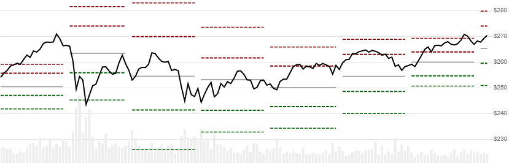

# Pivot Points

[Pivot Points](https://en.wikipedia.org/wiki/Pivot_point_(technical_analysis)) depict support and resistance levels, based on the prior lookback window.  You can specify window size (e.g. month, week, day, etc).
See also the alternative [Rolling Pivot Points](../RollingPivots/README.md#content) variant for a modern update that uses a rolling window.
[[Discuss] :speech_balloon:](https://github.com/DaveSkender/Stock.Indicators/discussions/274 "Community discussion about this indicator")



```csharp
// usage
IEnumerable<PivotPointResult> results =
  Indicator.GetPivotPoints(history, windowSize, pointType);  
```

## Parameters

| name | type | notes
| -- |-- |--
| `history` | IEnumerable\<[TQuote](../../docs/GUIDE.md#historical-quotes)\> | Historical price quotes should have a consistent frequency (day, hour, minute, etc)
| `windowSize` | PeriodSize | Size of the lookback window
| `pointType` | PivotPointType | Type of Pivot Point.  Default is `PivotPointType.Standard`

### Minimum history requirements

You must supply at least `2` windows of `history`.  For example, if you specify a `Week` window size, you need at least 14 calendar days of `history`.

### PeriodSize options (for windowSize)

| type | description
|-- |--
| `PeriodSize.Month` | Use the prior month's data to calculate current month's Pivot Points
| `PeriodSize.Week` | [..] weekly
| `PeriodSize.Day` | [..] daily.  Commonly used for intraday data.
| `PeriodSize.Hour` | [..] hourly

### PivotPointType options

| type | description
|-- |--
| `PivotPointType.Standard` | Floor Trading (default)
| `PivotPointType.Camarilla` | Camarilla
| `PivotPointType.Demark` | Demark
| `PivotPointType.Fibonacci` | Fibonacci
| `PivotPointType.Woodie` | Woodie

## Response

```csharp
IEnumerable<PivotPointsResult>
```

The first window will have `null` values since there's not enough data to calculate.  We always return the same number of elements as there are in the historical quotes.

:warning: **Warning**: The second window may be innaccurate if the first window contains incomplete data.  For example, this can occur if you specify a `Month` window size and only provide 45 calendar days (1.5 months) of `history`.

### PivotPointResult

| name | type | notes
| -- |-- |--
| `Date` | DateTime | Date
| `R3` | decimal | Resistance level 3
| `R2` | decimal | Resistance level 2
| `R1` | decimal | Resistance level 1
| `PP` | decimal | Pivot Point
| `S1` | decimal | Support level 1
| `S2` | decimal | Support level 2
| `S3` | decimal | Support level 3

## Example

```csharp
// fetch historical quotes from your favorite feed, in Quote format
IEnumerable<Quote> history = GetHistoryFromFeed("SPY");

// calculate Woodie-style month-based Pivot Points
IEnumerable<PivotPointResult> results =
  Indicator.GetPivotPoints(history,PeriodSize.Month,PivotPointType.Woodie);

// use results as needed
PivotPointsResult result = results.LastOrDefault();
Console.WriteLine("PP on {0} was ${1}", result.Date, result.PP);
```

```bash
PP on 12/31/2018 was $251.86
```
