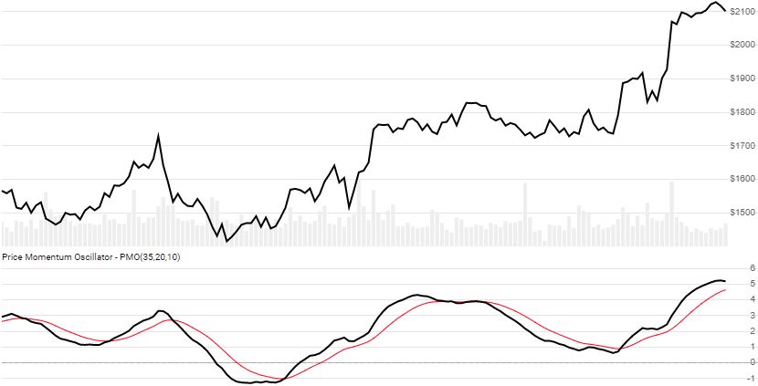

# Price Momentum Oscillator (PMO)

Created by Carl Swenlin, the DecisionPoint [Price Momentum Oscillator](https://school.stockcharts.com/doku.php?id=technical_indicators:dppmo) is double-smoothed ROC based momentum indicator.
[[Discuss] :speech_balloon:](https://github.com/DaveSkender/Stock.Indicators/discussions/244 "Community discussion about this indicator")



```csharp
// usage
IEnumerable<PmoResult> results = Indicator.GetPmo(history, timePeriod, smoothingPeriod, signalPeriod);
```

## Parameters

| name | type | notes
| -- |-- |--
| `history` | IEnumerable\<[TQuote](../../docs/GUIDE.md#historical-quotes)\> | Historical price quotes should have a consistent frequency (day, hour, minute, etc).
| `timePeriod` | int | Number of periods (`T`) for ROC EMA smoothing.  Must be greater than 1.  Default is 35.
| `smoothingPeriod` | int | Number of periods (`S`) for PMO EMA smoothing.  Must be greater than 0.  Default is 20.
| `signalPeriod` | int | Number of periods (`G`) for Signal line EMA.  Must be greater than 0.  Default is 10.

### Minimum history requirements

You must supply at least `N` periods of `history`, where `N` is the greater of `T+S`,`2×T`, or `T+100`.  Since this uses multiple smoothing operations, we recommend you use at least `N+250` data points prior to the intended usage date for better precision.

## Response

```csharp
IEnumerable<PmoResult>
```

The first `T+S-1` periods will have `null` values for PMO since there's not enough data to calculate.  We always return the same number of elements as there are in the historical quotes.

:warning: **Warning**: The first `N+250` periods will have decreasing magnitude, convergence-related precision errors that can be as high as ~5% deviation in indicator values for earlier periods.

### PmoResult

| name | type | notes
| -- |-- |--
| `Date` | DateTime | Date
| `Pmo` | decimal | Price Momentum Oscillator
| `Signal` | decimal | Signal line is EMA of PMO

## Example

```csharp
// fetch historical quotes from your favorite feed, in Quote format
IEnumerable<Quote> history = GetHistoryFromFeed("SPY");

// calculate 20-period PMO
IEnumerable<PmoResult> results = Indicator.GetPmo(history,35,20,10);

// use results as needed
PmoResult result = results.LastOrDefault();
Console.WriteLine("PMO on {0} was {1}", result.Date, result.Pmo);
```

```bash
PMO on 12/31/2018 was -2.70
```
