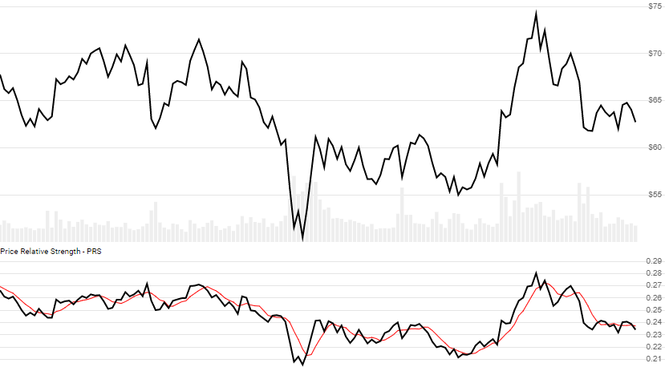

# Price Relative Strength (PRS)

[Price Relative Strength (PRS)](https://en.wikipedia.org/wiki/Relative_strength), also called Comparative Relative Strength, shows the ratio of two quote histories, based on Close price.  It is often used to compare against a market index or sector ETF.  When using the optional `lookbackPeriod`, this also returns relative percent change over the specified periods.  This is not the same as the more prevalent [Relative Strength Index (RSI)](../Rsi/README.md).
[[Discuss] :speech_balloon:](https://github.com/DaveSkender/Stock.Indicators/discussions/243 "Community discussion about this indicator")



```csharp
// usage
IEnumerable<PrsResult> results =
  historyBase.GetPrs(historyEval);  

// usage with optional lookback period and SMA of PRS (shown above)
IEnumerable<PrsResult> results =
  historyBase.GetPrs(historyEval, lookbackPeriod, smaPeriod);  
```

## Parameters

| name | type | notes
| -- |-- |--
| `historyEval` | IEnumerable\<[TQuote](../../docs/GUIDE.md#historical-quotes)\> | Historical quotes for evaluation.  You must have the same number of periods as `historyBase`.
| `lookbackPeriod` | int | Optional.  Number of periods (`N`) to lookback to compute % difference.  Must be greater than 0 if specified or `null`.
| `smaPeriod` | int | Optional.  Number of periods (`S`) in the SMA lookback period for `Prs`.  Must be greater than 0.

### Historical quotes requirements

You must have at least `N` periods of `historyBase` to calculate `PrsPercent` if `lookbackPeriod` is specified; otherwise, you must specify at least `S+1` periods.  More than the minimum is typically specified.  For this indicator, the elements must match (e.g. the `n`th elements must be the same date).  An `Exception` will be thrown for mismatch dates.  Historical price quotes should have a consistent frequency (day, hour, minute, etc).

`historyBase` is an `IEnumerable<TQuote>` collection of historical price quotes.  It should have a consistent frequency (day, hour, minute, etc).  See [the Guide](../../docs/GUIDE.md) for more information.

## Response

```csharp
IEnumerable<PrsResult>
```

The `N` periods will have `null` values for `PrsPercent` and the first `S-1` periods will have `null` values for `Sma` since there's not enough data to calculate.  We always return the same number of elements as there are in the historical quotes.

### PrResult

| name | type | notes
| -- |-- |--
| `Date` | DateTime | Date
| `Prs` | decimal | Price Relative Strength compares `Eval` to `Base` histories
| `PrsSma` | decimal | Moving Average (SMA) of PRS over `S` periods
| `PrsPercent` | decimal | Percent change difference between `Eval` and `Base` over `N` periods

## Example

```csharp
// fetch historical quotes from your feed (your method)
IEnumerable<Quote> historySPX = GetHistoryFromFeed("SPX");
IEnumerable<Quote> historyTSLA = GetHistoryFromFeed("TSLA");

// calculate 14-period PRS
IEnumerable<PrResult> results = historySPX.GetPrs(historyTSLA,14);

// use results as needed
PrResult result = results.LastOrDefault();
Console.WriteLine("PRS(SPX,TSLA,14) on {0} was {1}", result.Date, result.PriceRatio);
```

```bash
PRS(SPX,TSLA,14) on 12/31/2018 was 1.36
```
