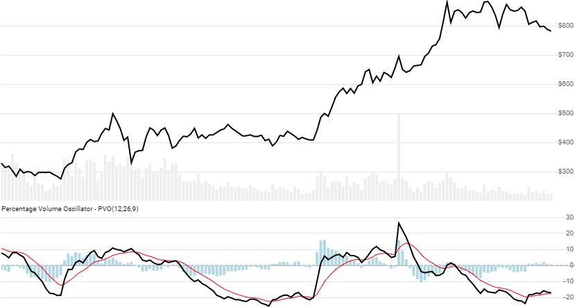

# Percentage Volume Oscillator (PVO)

The [Percentage Volume Oscillator](https://school.stockcharts.com/doku.php?id=technical_indicators:percentage_volume_oscillator_pvo) is a simple oscillator view of two converging/diverging exponential moving averages of Volume.
[[Discuss] :speech_balloon:](https://github.com/DaveSkender/Stock.Indicators/discussions/305 "Community discussion about this indicator")



```csharp
// usage
IEnumerable<PvoResult> results =
  history.GetPvo(fastPeriod, slowPeriod, signalPeriod);  
```

## Parameters

| name | type | notes
| -- |-- |--
| `fastPeriod` | int | Number of periods (`F`) for the faster moving average.  Must be greater than 0.  Default is 12.
| `slowPeriod` | int | Number of periods (`S`) for the slower moving average.  Must be greater than `fastPeriod`.  Default is 26.
| `signalPeriod` | int | Number of periods (`P`) for the moving average of PVO.  Must be greater than or equal to 0.  Default is 9.

### Historical quotes requirements

You must have at least `2×(S+P)` or `S+P+100` worth of `history`, whichever is more.  Since this uses a smoothing technique, we recommend you use at least `S+P+250` data points prior to the intended usage date for better precision.

`history` is an `IEnumerable<TQuote>` collection of historical price quotes.  It should have a consistent frequency (day, hour, minute, etc).  See [the Guide](../../docs/GUIDE.md) for more information.

## Response

```csharp
IEnumerable<PvoResult>
```

The first `S-1` slow periods will have `null` values since there's not enough data to calculate.  We always return the same number of elements as there are in the historical quotes.

:warning: **Warning**: The first `S+P+250` periods will have decreasing magnitude, convergence-related precision errors that can be as high as ~5% deviation in indicator values for earlier periods.

### PvoResult

| name | type | notes
| -- |-- |--
| `Date` | DateTime | Date
| `Pvo` | decimal | Normalized difference between two Volume moving averages
| `Signal` | decimal | Moving average of the `Pvo` line
| `Histogram` | decimal | Gap between of the `Pvo` and `Signal` line

## Example

```csharp
// fetch historical quotes from your feed (your method)
IEnumerable<Quote> history = GetHistoryFromFeed("SPY");

// calculate Pvo(12,26,9)
IEnumerable<PvoResult> results = history.GetPvo(12,26,9);

// use results as needed
PvoResult result = results.LastOrDefault();
Console.WriteLine("PVO on {0} was {1}", result.Date, result.Pvo);
```

```bash
PVO on 12/31/2018 was -6.22
```
