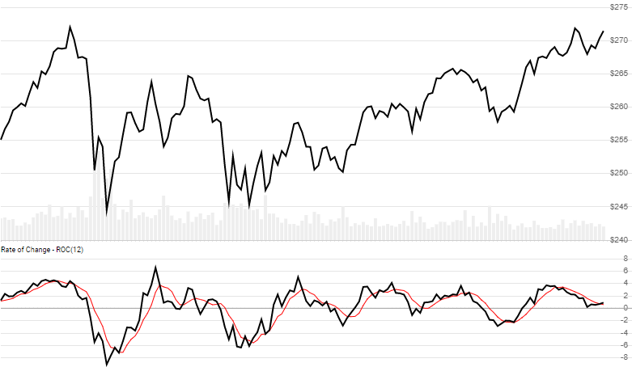

# Rate of Change (ROC) and Momentum Oscillator

Rate of Change, also known as Momentum Oscillator, is the percent change of Close price over `N` lookback periods.
[More info ...](https://school.stockcharts.com/doku.php?id=technical_indicators:rate_of_change_roc_and_momentum)



```csharp
// usage
IEnumerable<RocResult> results = Indicator.GetRoc(history, lookbackPeriod);

// usage with optional SMA of ROC (shown above)
IEnumerable<RocResult> results = Indicator.GetRoc(history, lookbackPeriod, smaPeriod);
```

## Parameters

| name | type | notes
| -- |-- |--
| `history` | IEnumerable\<[Quote](../../docs/GUIDE.md#quote)\> | Historical Quotes data should be at any consistent frequency (day, hour, minute, etc).  You must supply at least `N+1` periods of `history`.
| `lookbackPeriod` | int | Number of periods (`N`) to go back.  Must be greater than 0.
| `smaPeriod` | int | Optional.  Number of periods in the moving average of ROC.  Must be greater than 0, if specified.

## Response

```csharp
IEnumerable<RocResult>
```

The first `N` periods will have `null` values for ROC since there's not enough data to calculate.  We always return the same number of elements as there are in the historical quotes.

### RocResult

| name | type | notes
| -- |-- |--
| `Date` | DateTime | Date
| `Roc` | decimal | Rate of Change over `N` lookback periods
| `Sma` | decimal | SMA of the ROC based on `smaPeriod` periods, if specified

## Example

```csharp
// fetch historical quotes from your favorite feed, in Quote format
IEnumerable<Quote> history = GetHistoryFromFeed("SPY");

// calculate 20-period ROC
IEnumerable<RocResult> results = Indicator.GetRoc(history,20);

// use results as needed
DateTime evalDate = DateTime.Parse("12/31/2018");
RocResult result = results.Where(x=>x.Date==evalDate).FirstOrDefault();
Console.WriteLine("ROC on {0} was {1}%", result.Date, result.Roc);
```

```bash
ROC on 12/31/2018 was -8.25%
```
