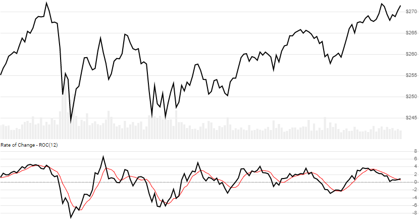

# Rate of Change (ROC) and Momentum Oscillator

[Rate of Change](https://en.wikipedia.org/wiki/Momentum_(technical_analysis)), also known as Momentum Oscillator, is the percent change of Close price over a lookback window.  A [Rate of Change with Bands](#roc-with-bands) variant, created by Vitali Apirine, is also included.
[[Discuss] :speech_balloon:](https://github.com/DaveSkender/Stock.Indicators/discussions/242 "Community discussion about this indicator")



```csharp
// usage
IEnumerable<RocResult> results =
  history.GetRoc(lookbackPeriods);

// usage with optional SMA of ROC (shown above)
IEnumerable<RocResult> results =
  history.GetRoc(lookbackPeriods, smaPeriod);
```

## Parameters

| name | type | notes
| -- |-- |--
| `lookbackPeriods` | int | Number of periods (`N`) to go back.  Must be greater than 0.
| `smaPeriod` | int | Optional.  Number of periods in the moving average of ROC.  Must be greater than 0, if specified.

### Historical quotes requirements

You must have at least `N+1` periods of `history`.

`history` is an `IEnumerable<TQuote>` collection of historical price quotes.  It should have a consistent frequency (day, hour, minute, etc).  See [the Guide](../../docs/GUIDE.md) for more information.

## Response

```csharp
IEnumerable<RocResult>
```

The first `N` periods will have `null` values for ROC since there's not enough data to calculate.  We always return the same number of elements as there are in the historical quotes.

### RocResult

| name | type | notes
| -- |-- |--
| `Date` | DateTime | Date
| `Roc` | decimal | Rate of Change over `N` lookback periods (%, not decimal)
| `RocSma` | decimal | Moving average (SMA) of ROC based on `smaPeriod` periods, if specified

### Utilities

- [.Find()](../../docs/UTILITIES.md#find-indicator-result-by-date)
- [.PruneWarmupPeriods()](../../docs/UTILITIES.md#prune-warmup-periods)
- [.PruneWarmupPeriods(qty)](../../docs/UTILITIES.md#prune-warmup-periods)

See [Utilities and Helpers](../../docs/UTILITIES.md#content) for more information.

## Example

```csharp
// fetch historical quotes from your feed (your method)
IEnumerable<Quote> history = GetHistoryFromFeed("SPY");

// calculate 20-period ROC
IEnumerable<RocResult> results = history.GetRoc(20);

// use results as needed
RocResult result = results.LastOrDefault();
Console.WriteLine("ROC on {0} was {1}%", result.Date, result.Roc);
```

```bash
ROC on 12/31/2018 was -8.25%
```

## ROC with Bands


```csharp
// usage
IEnumerable<RocWbResult> results =
  history.GetRocWb(lookbackPeriods, emaPeriod, stdDevPeriod);
```

### Parameters with Bands

| name | type | notes
| -- |-- |--
| `lookbackPeriods` | int | Number of periods (`N`) to go back.  Must be greater than 0.  Typical values range from 10-20.
| `emaPeriod` | int | Number of periods for the ROC EMA line.  Must be greater than 0.  Standard is 3.
| `stdDevPeriod` | int | Number of periods the standard deviation for upper/lower band lines.  Must be greater than 0 and not more than `lookbackPeriods`.  Standard is to use same value as `lookbackPeriods`.

### RocWbResult

| name | type | notes
| -- |-- |--
| `Date` | DateTime | Date
| `Roc` | decimal | Rate of Change over `N` lookback periods (%, not decimal)
| `RocEma` | decimal | Exponential moving average (EMA) of `Roc`
| `UpperBand` | decimal | Upper band of ROC (overbought indicator)
| `LowerBand` | decimal | Lower band of ROC (oversold indicator)
