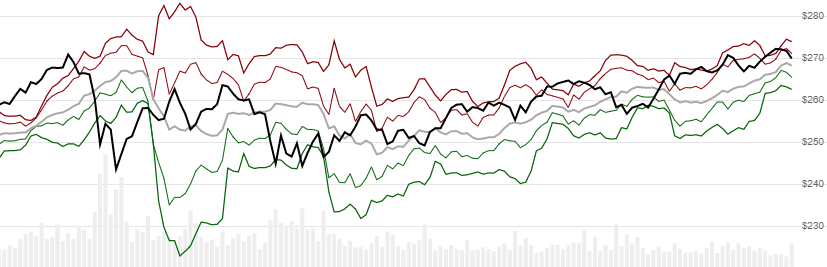

# Rolling Pivot Points

Created by Dave Skender, Rolling Pivot Points is a modern update to traditional fixed calendar window [Pivot Points](../PivotPoints/README.md#content).  It depicts support and resistance levels, based on a defined _rolling_ window and offset.
[[Discuss] :speech_balloon:](https://github.com/DaveSkender/Stock.Indicators/discussions/274 "Community discussion about this indicator")



```csharp
// usage
IEnumerable<PivotPointResult> results = 
  history.GetRollingPivots(lookbackPeriod, offsetPeriod, pointType);  
```

## Parameters

| name | type | notes
| -- |-- |--
| `windowPeriod` | int | Number of periods (`W`) in the evaluation window.  Must be greater than 0 to calculate; but is typically specified in the 5-20 range.
| `offsetPeriod` | int | Number of periods (`F`) to offset the window from the current period.  Must be greater than or equal to 0 and is typically less than or equal to `W`.
| `pointType` | PivotPointType | Type of Pivot Point.  Default is `PivotPointType.Standard`

For example, a window of 8 with an offset of 4 would evaluate history like: `W W W W W W W W F F  F F C`, where `W` is the window included in the Pivot Point calculation, and `F` is the distance from the current evaluation position `C`.  A `history` with daily bars using `W/F` values of `20/10` would most closely match the `month` variant of the traditional [Pivot Points](../PivotPoints/README.md#content) indicator.

### Historical quotes requirements

You must have at least `W+F` periods of `history`.

`history` is an `IEnumerable<TQuote>` collection of historical price quotes.  It should have a consistent frequency (day, hour, minute, etc).  See [the Guide](../../docs/GUIDE.md) for more information.

### PivotPointType options

| type | description
|-- |--
| `PivotPointType.Standard` | Floor Trading (default)
| `PivotPointType.Camarilla` | Camarilla
| `PivotPointType.Demark` | Demark
| `PivotPointType.Fibonacci` | Fibonacci
| `PivotPointType.Woodie` | Woodie

## Response

```csharp
IEnumerable<PivotPointsResult>
```

The first `W+F-1` periods will have `null` values since there's not enough data to calculate.  We always return the same number of elements as there are in the historical quotes.

### PivotPointResult

| name | type | notes
| -- |-- |--
| `Date` | DateTime | Date
| `R3` | decimal | Resistance level 3
| `R2` | decimal | Resistance level 2
| `R1` | decimal | Resistance level 1
| `PP` | decimal | Pivot Point
| `S1` | decimal | Support level 1
| `S2` | decimal | Support level 2
| `S3` | decimal | Support level 3

## Example

```csharp
// fetch historical quotes from your feed (your method)
IEnumerable<Quote> history = GetHistoryFromFeed("SPY");

// calculate Woodie-style 14 period Rolling Pivot Points
IEnumerable<PivotPointResult> results = 
  history.GetRollingPivots(14,0,PivotPointType.Woodie);

// use results as needed
PivotPointsResult result = results.LastOrDefault();
Console.WriteLine("PP on {0} was ${1}", result.Date, result.PP);
```

```bash
PP on 12/31/2018 was $251.86
```
