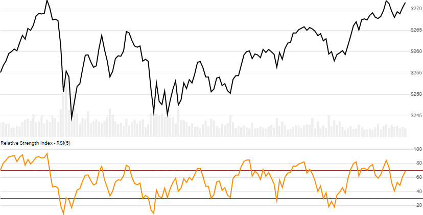

# Relative Strength Index (RSI)

Created by J. Welles Wilder, the [Relative Strength Index](https://en.wikipedia.org/wiki/Relative_strength_index) measures strength of the winning/losing streak over `N` lookback periods on a scale of 0 to 100, to depict overbought and oversold conditions.  [[Discuss] :speech_balloon:](https://github.com/DaveSkender/Stock.Indicators/discussions/224 "Community discussion about this indicator")



```csharp
// usage
IEnumerable<RsiResult> results =
  quotes.GetRsi(lookbackPeriods);  
```

## Parameters

| name | type | notes
| -- |-- |--
| `lookbackPeriods` | int | Number of periods (`N`) in the lookback period.  Must be greater than 0.  Default is 14.

### Historical quotes requirements

You must have at least `N+100` periods of `quotes`.  Since this uses a smoothing technique, we recommend you use at least `10×N` data points prior to the intended usage date for better precision.

`quotes` is an `IEnumerable<TQuote>` collection of historical price quotes.  It should have a consistent frequency (day, hour, minute, etc).  See [the Guide](../../docs/GUIDE.md) for more information.

## Response

```csharp
IEnumerable<RsiResult>
```

The first `N-1` periods will have `null` values since there's not enough data to calculate.  We always return the same number of elements as there are in the historical quotes.

:warning: **Warning**: The first `10×N` periods will have decreasing magnitude, convergence-related precision errors that can be as high as ~5% deviation in indicator values for earlier periods.

### RsiResult

| name | type | notes
| -- |-- |--
| `Date` | DateTime | Date
| `Rsi` | decimal | RSI over prior `N` lookback periods

### Utilities

- [.Find()](../../docs/UTILITIES.md#find-indicator-result-by-date)
- [.PruneWarmupPeriods()](../../docs/UTILITIES.md#prune-warmup-periods)
- [.PruneWarmupPeriods(qty)](../../docs/UTILITIES.md#prune-warmup-periods)

See [Utilities and Helpers](../../docs/UTILITIES.md#content) for more information.

## Example

```csharp
// fetch historical quotes from your feed (your method)
IEnumerable<Quote> quotes = GetHistoryFromFeed("SPY");

// calculate RSI(14)
IEnumerable<RsiResult> results = quotes.GetRsi(14);

// use results as needed
RsiResult result = results.LastOrDefault();
Console.WriteLine("RSI on {0} was {1}", result.Date, result.Rsi);
```

```bash
RSI on 12/31/2018 was 42.08
```
