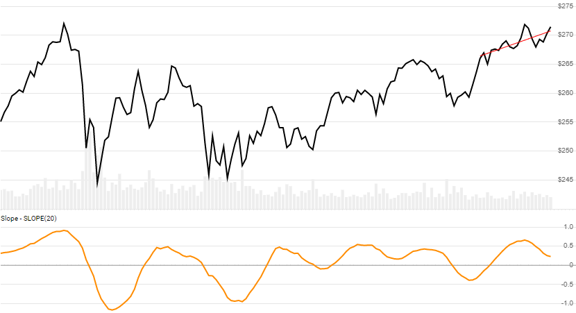

# Slope and Linear Regression

[Slope of the best fit line](https://school.stockcharts.com/doku.php?id=technical_indicators:slope) is determined by an [ordinary least-squares simple linear regression](https://en.wikipedia.org/wiki/Simple_linear_regression) on Close price.  It can be used to help identify trend strength and direction.  Standard Deviation, R&sup2;, and a best-fit `Line` (for last lookback segment) are also output.  See also [Standard Deviation Channels](../StdDevChannels/README.md) for an alternative depiction.
[[Discuss] :speech_balloon:](https://github.com/DaveSkender/Stock.Indicators/discussions/241 "Community discussion about this indicator")



```csharp
// usage
IEnumerable<SlopeResult> results = Indicator.GetSlope(history, lookbackPeriod);  
```

## Parameters

| name | type | notes
| -- |-- |--
| `history` | IEnumerable\<[TQuote](../../docs/GUIDE.md#historical-quotes)\> | Historical price quotes should have a consistent frequency (day, hour, minute, etc).
| `lookbackPeriod` | int | Number of periods (`N`) for the linear regression.  Must be greater than 0.

### Minimum history requirements

You must supply at least `N` periods of `history`.

## Response

```csharp
IEnumerable<SlopeResult>
```

The first `N-1` periods will have `null` values for `Slope` since there's not enough data to calculate.  We always return the same number of elements as there are in the historical quotes.

### SlopeResult

| name | type | notes
| -- |-- |--
| `Date` | DateTime | Date
| `Slope` | decimal | Slope `m` of the best-fit line of Close price
| `Intercept` | decimal | Y-Intercept `b` of the best-fit line
| `StdDev` | double | Standard Deviation of Close price over `N` lookback periods
| `RSquared` | double | R-Squared (R&sup2;), aka Coefficient of Determination
| `Line` | decimal | Best-fit line `y` over the last 'N' periods (i.e. `y=mx+b` using last period values)

## Example

```csharp
// fetch historical quotes from your favorite feed, in Quote format
IEnumerable<Quote> historySPX = GetHistoryFromFeed("SPX");

// calculate 20-period Slope
IEnumerable<SlopeResult> results = Indicator.GetSlope(history,20);

// use results as needed
SlopeResult result = results.LastOrDefault();
Console.WriteLine("SLOPE(20) on {0} was {1}", result.Date, result.Slope);
```

```bash
SLOPE(20) on 12/31/2018 was -1.69
```
