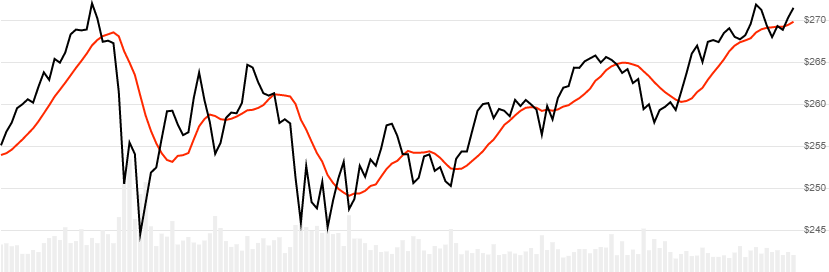

# Simple Moving Average (SMA)

[Simple Moving Average](https://en.wikipedia.org/wiki/Moving_average#Simple_moving_average) is the average of Close price over a lookback window.
[[Discuss] :speech_balloon:](https://github.com/DaveSkender/Stock.Indicators/discussions/240 "Community discussion about this indicator")



```csharp
// usage
IEnumerable<SmaResult> results = Indicator.GetSma(history, lookbackPeriod);  
```

## Parameters

| name | type | notes
| -- |-- |--
| `history` | IEnumerable\<[TQuote](../../docs/GUIDE.md#historical-quotes)\> | Historical price quotes should have a consistent frequency (day, hour, minute, etc).
| `lookbackPeriod` | int | Number of periods (`N`) in the lookback window.  Must be greater than 0.

### Minimum history requirements

You must supply at least `N` periods of `history`.

## Response

```csharp
IEnumerable<SmaResult>
```

The first `N-1` periods will have `null` values since there's not enough data to calculate.  We always return the same number of elements as there are in the historical quotes.

### SmaResult

| name | type | notes
| -- |-- |--
| `Date` | DateTime | Date
| `Sma` | decimal | Simple moving average

## Example

```csharp
// fetch historical quotes from your favorite feed, in Quote format
IEnumerable<Quote> history = GetHistoryFromFeed("MSFT");

// calculate 20-period SMA
IEnumerable<SmaResult> results = Indicator.GetSma(history,20);

// use results as needed
SmaResult result = results.LastOrDefault();
Console.WriteLine("SMA on {0} was ${1}", result.Date, result.Sma);
```

```bash
SMA on 12/31/2018 was $251.86
```

## Extended analysis

An extended variant of this indicator includes additional analysis.

```csharp
// usage
IEnumerable<SmaExtendedResult> results = Indicator.GetSmaExtended(history, lookbackPeriod);  
```

### SmaExtendedResult

| name | type | notes
| -- |-- |--
| `Date` | DateTime | Date
| `Sma` | decimal | Simple moving average
| `Mad` | decimal | Mean absolute deviation
| `Mse` | decimal | Mean square error
| `Mape` | decimal | Mean absolute percentage error
