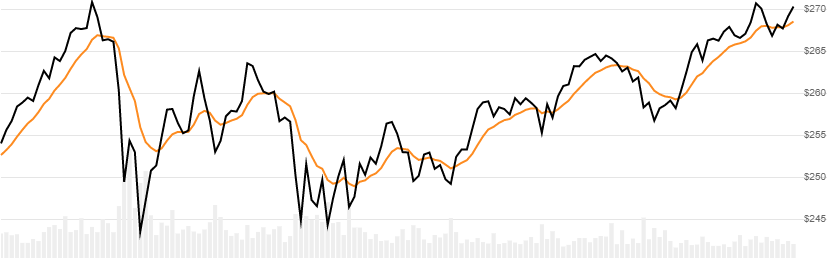

# Smoothed Moving Average (SMMA)

[Smoothed Moving Average](https://en.wikipedia.org/wiki/Moving_average#Modified_moving_average) is the average of Close price over a lookback window using a smoothing method.
[[Discuss] :speech_balloon:](https://github.com/DaveSkender/Stock.Indicators/discussions/375 "Community discussion about this indicator")



```csharp
// usage
IEnumerable<SmmaResult> results = Indicator.GetSmma(history, lookbackPeriod);  
```

## Parameters

| name | type | notes
| -- |-- |--
| `history` | IEnumerable\<[TQuote](../../docs/GUIDE.md#historical-quotes)\> | Historical price quotes should have a consistent frequency (day, hour, minute, etc).
| `lookbackPeriod` | int | Number of periods (`N`) in the moving average.  Must be greater than 0.

### Minimum history requirements

You must supply at least `N` periods of `history`.

## Response

```csharp
IEnumerable<SmmaResult>
```

The first `N-1` periods will have `null` values since there's not enough data to calculate.  We always return the same number of elements as there are in the historical quotes.

### SmmaResult

| name | type | notes
| -- |-- |--
| `Date` | DateTime | Date
| `Smma` | decimal | Smoothed moving average

## Example

```csharp
// fetch historical quotes from your favorite feed, in Quote format
IEnumerable<Quote> history = GetHistoryFromFeed("MSFT");

// calculate 20-period SMMA
IEnumerable<SmmaResult> results = Indicator.GetSmma(history,20);

// use results as needed
SmmaResult result = results.LastOrDefault();
Console.WriteLine("SMMA on {0} was ${1}", result.Date, result.Smma);
```

```bash
SMMA on 12/31/2018 was $255.67
```