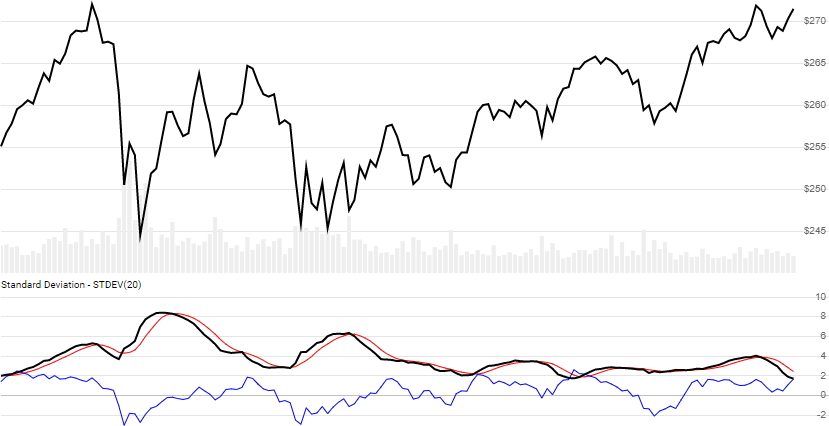

# Standard Deviation (Volatility)

Standard Deviation of Close price over a lookback period.
[More info ...](https://school.stockcharts.com/doku.php?id=technical_indicators:standard_deviation_volatility)



```csharp
// usage
IEnumerable<StdDevResult> results = Indicator.GetStdDev(history, lookbackPeriod);  

// usage with optional SMA of STDEV (shown above)
IEnumerable<StdDevResult> results = Indicator.GetStdDev(history, lookbackPeriod, smaPeriod);  
```

## Parameters

| name | type | notes
| -- |-- |--
| `history` | IEnumerable\<[Quote](../../docs/GUIDE.md#quote)\> | Historical Quotes data should be at any consistent frequency (day, hour, minute, etc).  You must supply at least `N` periods of `history`.
| `lookbackPeriod` | int | Number of periods (`N`) in the lookback period.  Must be greater than 1 to calculate; however we suggest a larger period for statistically appropriate sample size.
| `smaPeriod` | int | Optional.  Number of periods (`N`) in the moving average of ROC.  Must be greater than 0, if specified.

## Response

```csharp
IEnumerable<StdDevResult>
```

The first `N-1` periods will have `null` values since there's not enough data to calculate.  We always return the same number of elements as there are in the historical quotes.

### StdDevResult

| name | type | notes
| -- |-- |--
| `Date` | DateTime | Date
| `StdDev` | decimal | Standard Deviation of Close price based on `N` lookback periods
| `ZScore` | decimal | Z-Score of current Close price (number of standard deviations from mean)
| `Sma` | decimal | SMA of the `StDev` based on `smaPeriod` periods, if specified

## Example

```csharp
// fetch historical quotes from your favorite feed, in Quote format
IEnumerable<Quote> history = GetHistoryFromFeed("SPX");

// calculate 10-period Standard Deviation
IEnumerable<StdDevResult> results = Indicator.GetStdDev(history,10);

// use results as needed
DateTime evalDate = DateTime.Parse("12/31/2018");
StdDevResult result = results.Where(x=>x.Date==evalDate).FirstOrDefault();
Console.WriteLine("StdDev(SPX,10) on {0} was ${1}", result.Date, result.StdDev);
```

```bash
StdDev(SPX,10) on 12/31/2018 was $5.4738
```
