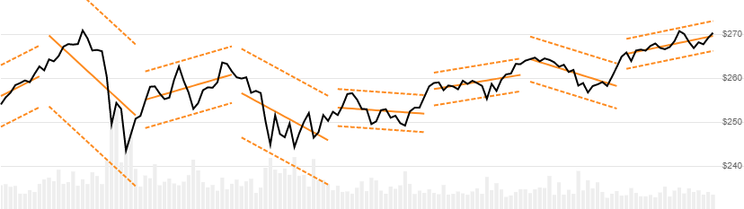
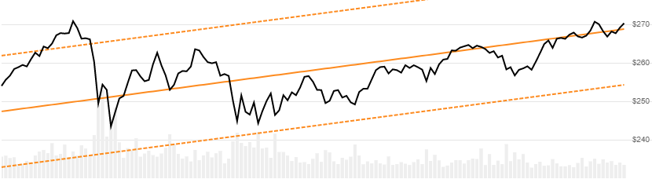

# Standard Deviation Channels

Standard Deviation Channels are based on an linear regression centerline and standard deviations band widths.
[[Discuss] :speech_balloon:](https://github.com/DaveSkender/Stock.Indicators/discussions/368 "Community discussion about this indicator")



```csharp
// usage
IEnumerable<StdDevChannelsResult> results =
  Indicator.GetStdDevChannels(history, lookbackPeriod, standardDeviations);  
```

## Parameters

| name | type | notes
| -- |-- |--
| `history` | IEnumerable\<[TQuote](../../docs/GUIDE.md#historical-quotes)\> | Historical price quotes should have a consistent frequency (day, hour, minute, etc).
| `lookbackPeriod` | int | Size (`N`) of the evaluation window.  Must be `null` or greater than 1 to calculate.  A `null` value will produce a full `history` evaluation window ([see below](#alternative-depiction-for-full-history-variant)).  Default is 20.
| `standardDeviations` | int | Width of bands.  Standard deviations (`D`) from the regression line.  Must be greater than 0.  Default is 2.

### Minimum history requirements

You must supply at least `N` periods of `history`.

## Response

```csharp
IEnumerable<StdDevChannelsResult>
```

Up to `N-1` periods will have `null` values since there's not enough data to calculate.  We always return the same number of elements as there are in the historical quotes.

:warning: **Warning**: Historical results are a function of the current period window position and will fluctuate over time.  Recommended for visualization; not recommended for backtesting.

### StdDevChannelsResult

| name | type | notes
| -- |-- |--
| `Date` | DateTime | Date
| `Centerline` | decimal | Linear regression line (center line)
| `UpperChannel` | decimal | Upper line is `D` standard deviations above the center line
| `LowerChannel` | decimal | Lower line is `D` standard deviations below the center line
| `BreakPoint` | bool | Helper information.  Indicates first point in new window.

## Example

```csharp
// fetch historical quotes from your favorite feed, in Quote format
IEnumerable<Quote> history = GetHistoryFromFeed("SPY");

// calculate StdDevChannels(20,2)
IEnumerable<StdDevChannelsResult> results =
  Indicator.GetStdDevChannels(history,20,2);

// use results as needed
StdDevChannelsResult result = results.LastOrDefault();
Console.WriteLine("Upper Channel on {0} was ${1}",
  result.Date, result.UpperBand);
```

```bash
Upper Channel on 12/31/2018 was $213.97
```

## Alternative depiction for full history variant

If you specify `null` for the `lookbackPeriod`, you will get a regression line over the entire provided `history`.


