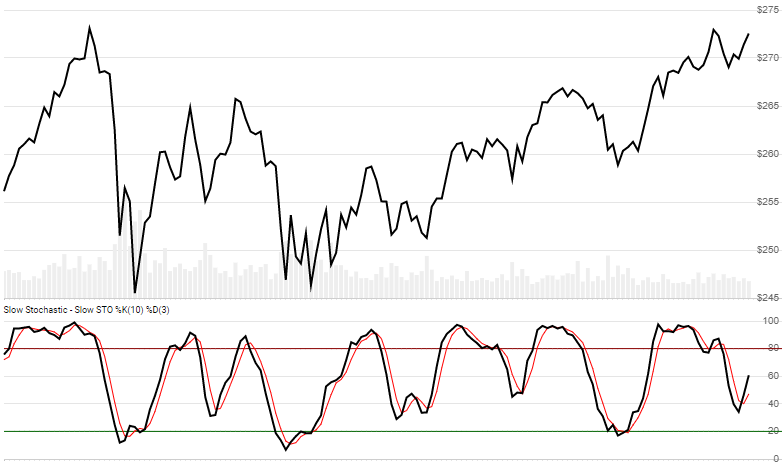

# Stochastic Oscillator

Created by George Lane, the [Stochastic Oscillator](https://en.wikipedia.org/wiki/Stochastic_oscillator) is a momentum indicator that looks back `N` periods to produce a scale of 0 to 100.  %J is also included for the KDJ Index extension.
[[Discuss] :speech_balloon:](https://github.com/DaveSkender/Stock.Indicators/discussions/237 "Community discussion about this indicator")



```csharp
// usage
IEnumerable<StochResult> results =
  history.GetStoch(lookbackPeriod, signalPeriod, smoothingPeriod);  
```

## Parameters

| name | type | notes
| -- |-- |--
| `lookbackPeriod` | int | Lookback period (`N`) for the oscillator (%K).  Must be greater than 0.  Default is 14.
| `signalPeriod` | int | Smoothing period for the signal (%D).  Must be greater than 0.  Default is 3.
| `smoothingPeriod` | int | Smoothing period (`S`) for the Oscillator (%K).  "Slow" stochastic uses 3, "Fast" stochastic uses 1.  Must be greater than 0.  Default is 3.

### Historical quotes requirements

You must have at least `N+S` periods of `history`.

`history` is an `IEnumerable<TQuote>` collection of historical price quotes.  It should have a consistent frequency (day, hour, minute, etc).  See [the Guide](../../docs/GUIDE.md) for more information.

## Response

```csharp
IEnumerable<StochResult>
```

The first `N+S-1` periods will have `null` Oscillator values since there's not enough data to calculate.  We always return the same number of elements as there are in the historical quotes.

### StochResult

| name | type | notes
| -- |-- |--
| `Date` | DateTime | Date
| `Oscillator` | decimal | %K Oscillator over prior `N` lookback periods
| `Signal` | decimal | %D Simple moving average of Oscillator
| `PercentJ` | decimal | %J is the weighted divergence of %K and %D: `%J=3×%K-2×%D`

## Example

```csharp
// fetch historical quotes from your feed (your method)
IEnumerable<Quote> history = GetHistoryFromFeed("SPY");

// calculate STO %K(14),%D(3) (slow)
IEnumerable<StochResult> results = history.GetStoch(14,3,3);

// use results as needed
StochResult result = results.LastOrDefault();
Console.WriteLine("STO on {0} was {1}", result.Date, result.Oscillator);
```

```bash
STOCH on 12/31/2018 was 43.1
```
