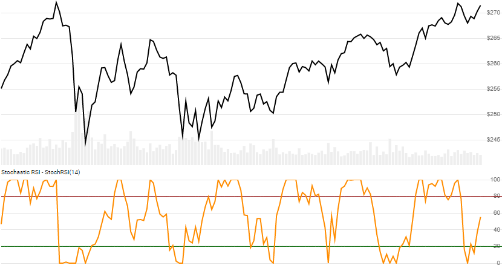

# Stochastic RSI

Created by by Tushar Chande and Stanley Kroll, [Stochastic RSI](https://school.stockcharts.com/doku.php?id=technical_indicators:stochrsi) is a Stochastic interpretation of the Relative Strength Index.  It is different from, and often confused with the more traditional [Stochastic Oscillator](../Stochastic/README.md).
[[Discuss] :speech_balloon:](https://github.com/DaveSkender/Stock.Indicators/discussions/236 "Community discussion about this indicator")



```csharp
// usage
IEnumerable<StochRsiResult> results = Indicator.GetStochRsi(history, rsiPeriod, stochPeriod, signalPeriod, smoothPeriod);
```

## Parameters

| name | type | notes
| -- |-- |--
| `history` | IEnumerable\<[TQuote](../../docs/GUIDE.md#quote)\> | Historical price quotes should have a consistent frequency (day, hour, minute, etc).
| `rsiPeriod` | int | Number of periods (`R`) in the lookback period.  Must be greater than 0.  Standard is 14.
| `stochPeriod` | int | Number of periods (`S`) in the lookback period.  Must be greater than 0.  Typically the same value as `rsiPeriod`.
| `signalPeriod` | int | Number of periods (`G`) in the signal line (SMA of the StochRSI).  Must be greater than 0.  Typically 3-5.
| `smoothPeriod` | int | Smoothing periods (`M`) for the Stochastic.  Must be greater than 0.  Default is 1 (Fast variant).

The original Stochasic RSI formula uses a the Fast variant of the Stochastic calculation (`smoothPeriod=1`).  For a standard period of 14, the original formula would be `GetStochRSI(history,14,14,3,1)`; though, the "3" here is just for the Signal, which is not present in the original formula, but useful for additional smoothing of the Stochastic RSI.

### Minimum history requirements

You must supply at least `R+S` periods of `history`.  Since this uses a smoothing technique in the underlying RSI value, we recommend you use at least 250 periods prior to the intended usage date for greater precision.

## Response

```csharp
IEnumerable<StochRsiResult>
```

The first `R+S-1` periods will have `null` values for `StochRsi` since there's not enough data to calculate.  We always return the same number of elements as there are in the historical quotes.

### StochRsiResult

| name | type | notes
| -- |-- |--
| `Date` | DateTime | Date
| `StochRsi` | decimal | %K Oscillator = Stochastic RSI = Stoch(`S`,`G`,`M`) of RSI(`R`) of Close price
| `Signal` | decimal | %D Signal Line = Simple moving average of %K based on `G` periods

## Example

```csharp
// fetch historical quotes from your favorite feed, in Quote format
IEnumerable<Quote> history = GetHistoryFromFeed("SPY");

// calculate StochRSI(14)
IEnumerable<StochRsiResult> results = Indicator.GetStochRsi(history,14,14,1,1);

// use results as needed
StochRsiResult result = results.LastOrDefault();
Console.WriteLine("StochRSI on {0} was {1}", result.Date, result.StochRsi);
```

```bash
StochRSI on 12/31/2018 was 0.975
```
