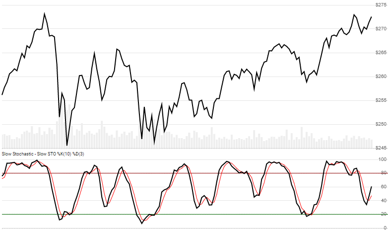

# Stochastic Oscillator

Stochastic Oscillator is a momentum indicator that looks back `N` periods to produce a scale of 0 to 100.
[More info ...](https://school.stockcharts.com/doku.php?id=technical_indicators:stochastic_oscillator_fast_slow_and_full)



```csharp
// usage
IEnumerable<StochResult> results = Indicator.GetStoch(history, lookbackPeriod, signalPeriod, smoothingPeriod);  
```

## Parameters

| name | type | notes
| -- |-- |--
| `history` | IEnumerable\<[Quote](../../docs/GUIDE.md#quote)\> | Historical Quotes data should be at any consistent frequency (day, hour, minute, etc).  You must supply at least `N+S` periods of `history`.
| `lookbackPeriod` | int | Lookback period (`N`) for the oscillator (%K).  Must be greater than 0.  Default is 14.
| `signalPeriod` | int | Lookback period for the signal (%D).  Must be greater than 0.  Default is 3.
| `smoothingPeriod` | int | Smoothing period `S` for the Oscillator (%K).  "Slow" stochastic uses 3, "Fast" stochastic uses 1.  You can specify as needed here.  Must be greater than or equal to 1.  Default is 3.

## Response

```csharp
IEnumerable<StochResult>
```

The first `N+S-1` periods will have `null` Oscillator values since there's not enough data to calculate.  We always return the same number of elements as there are in the historical quotes.

### StochResult

| name | type | notes
| -- |-- |--
| `Date` | DateTime | Date
| `Oscillator` | decimal | %K Oscillator over prior `N` lookback periods
| `Signal` | decimal | %D Simple moving average of Oscillator

## Example

```csharp
// fetch historical quotes from your favorite feed, in Quote format
IEnumerable<Quote> history = GetHistoryFromFeed("SPY");

// calculate STO %K(14),%D(3) (slow)
IEnumerable<StochResult> results = Indicator.GetStoch(history,14,3,3);

// use results as needed
DateTime evalDate = DateTime.Parse("12/31/2018");
StochResult result = results.Where(x=>x.Date==evalDate).FirstOrDefault();
Console.WriteLine("STO on {0} was {1}", result.Date, result.Oscillator);
```

```bash
STOCH on 12/31/2018 was 43.1
```
