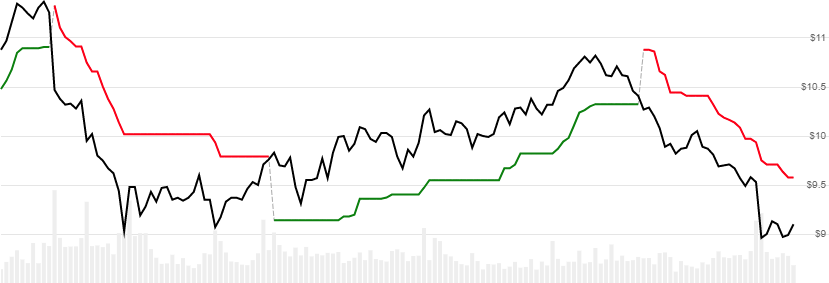

# SuperTrend

Created by Oliver Seban, the SuperTrend indicator attempts to determine the primary trend of Close prices by using [Average True Range (ATR)](../Atr/README.md) band thresholds.
It can indicate a buy/sell signal or a trailing stop when the trend changes.
[[Discuss] :speech_balloon:](https://github.com/DaveSkender/Stock.Indicators/discussions/235 "Community discussion about this indicator")



```csharp
// usage
IEnumerable<SuperTrendResult> results =
  history.GetSuperTrend(lookbackPeriod, multiplier);  
```

## Parameters

| name | type | notes
| -- |-- |--
| `lookbackPeriod` | int | Number of periods (`N`) for the ATR evaluation.  Must be greater than 1 and is usually set between 7 and 14.  Default is 10.
| `multiplier` | decimal | Multiplier sets the ATR band width.  Must be greater than 0 and is usually set around 2 to 3.  Default is 3.

### Historical quotes requirements

You must have at least `N+100` periods of `history`.  Since this uses a smoothing technique, we recommend you use at least `N+250` periods prior to the intended usage date for optimal precision.

`history` is an `IEnumerable<TQuote>` collection of historical price quotes.  It should have a consistent frequency (day, hour, minute, etc).  See [the Guide](../../docs/GUIDE.md) for more information.

## Response

```csharp
IEnumerable<SuperTrendResult>
```

The first `N-1` periods will have `null` SuperTrend values since there's not enough data to calculate.
We always return the same number of elements as there are in the historical quotes.

:warning: **Warning**: the line segment before the first reversal and the first `N+100` periods are unreliable due to an initial guess of trend direction and precision convergence for the underlying ATR values.

### SuperTrendResult

| name | type | notes
| -- |-- |--
| `Date` | DateTime | Date
| `SuperTrend` | decimal | SuperTrend line contains both Upper and Lower segments
| `UpperBand` | decimal | Upper band only (bearish/red)
| `LowerBand` | decimal | Lower band only (bullish/green)

`UpperBand` and `LowerBand` values are provided to differentiate bullish vs bearish trends and to clearly demark trend reversal.  `SuperTrend` is the contiguous combination of both upper and lower line data.

## Example

```csharp
// fetch historical quotes from your feed (your method)
IEnumerable<Quote> history = GetHistoryFromFeed("SPY");

// calculate SuperTrend(14,3)
IEnumerable<SuperTrendResult> results
  = history.GetSuperTrend(14,3);

// use results as needed
SuperTrendResult r = results.LastOrDefault();
Console.WriteLine("SuperTrend(14,3) on {0} was ${1}",
  r.Date, r.SuperTrend);
```

```bash
SuperTrend(14,3) on 12/31/2018 was $250.80
```
