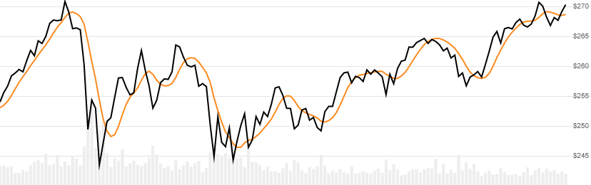

# Tillson T3 Moving Average

Created by Tim Tillson, the [T3](https://www.forexfactory.com/attachment.php/845855?attachmentid=845855&d=1322724313) indicator is a smooth moving average that reduces both lag and overshooting.
[[Discuss] :speech_balloon:](https://github.com/DaveSkender/Stock.Indicators/discussions/332 "Community discussion about this indicator")



```csharp
// usage
IEnumerable<T3Result> results = 
  history.GetT3(lookbackPeriod, volumeFactor);  
```

## Parameters

| name | type | notes
| -- |-- |--
| `lookbackPeriod` | int | Number of periods (`N`) for the EMA smoothing.  Must be greater than 0 and is usually less than 63.  Default is 5.
| `volumeFactor` | double | Size of the Volume Factor.  Must be greater than 0 and is usually less than 2.  Default is 0.7

### Historical quotes requirements

You must have at least `6×(N-1)+100` periods of `history`.  Since this uses a smoothing technique, we recommend you use at least `6×(N-1)+250` data points prior to the intended usage date for better precision.

`history` is an `IEnumerable<TQuote>` collection of historical price quotes.  It should have a consistent frequency (day, hour, minute, etc).  See [the Guide](../../docs/GUIDE.md) for more information.

## Response

```csharp
IEnumerable<T3Result>
```

The first `6×(N-1)` periods will have `null` values since there's not enough data to calculate.  We always return the same number of elements as there are in the historical quotes.

:warning: **Warning**: The first `6×(N-1)+250` periods will have decreasing magnitude, convergence-related precision errors that can be as high as ~5% deviation in indicator values for earlier periods.

### T3Result

| name | type | notes
| -- |-- |--
| `Date` | DateTime | Date
| `T3` | decimal | T3 Moving Average

## Example

```csharp
// fetch historical quotes from your feed (your method)
IEnumerable<Quote> history = GetHistoryFromFeed("MSFT");

// calculate 5-period T3
IEnumerable<T3Result> results = history.GetT3(5,0.7);

// use results as needed
T3Result result = results.LastOrDefault();
Console.WriteLine("T3 on {0} was {1}", result.Date, result.T3);
```

```bash
T3 on 12/31/2018 was $238.93
```
