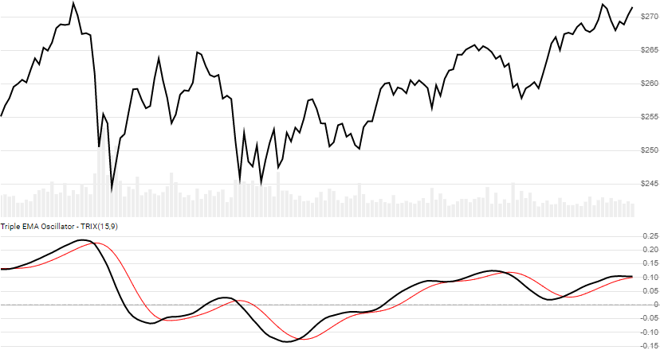

# Triple EMA Oscillator (TRIX)

Created by Jack Hutson, [TRIX](https://en.wikipedia.org/wiki/Trix_(technical_analysis)) is the rate of change for a 3 EMA smoothing of the Close price over a lookback window.  TRIX is often confused with [TEMA](../Ema/README.md).
[[Discuss] :speech_balloon:](https://github.com/DaveSkender/Stock.Indicators/discussions/234 "Community discussion about this indicator")



```csharp
// usage for Trix
IEnumerable<TrixResult> results = Indicator.GetTrix(history, lookbackPeriod);

// usage for Trix with Signal Line (shown above)
IEnumerable<TrixResult> results = Indicator.GetTrix(history, lookbackPeriod, signalPeriod);
```

## Parameters

| name | type | notes
| -- |-- |--
| `history` | IEnumerable\<[TQuote](../../docs/GUIDE.md#historical-quotes)\> | Historical price quotes should have a consistent frequency (day, hour, minute, etc).
| `lookbackPeriod` | int | Number of periods (`N`) in each of the the exponential moving averages.  Must be greater than 0.
| `signalPeriod` | int | Optional.  Number of periods in the moving average of TRIX.  Must be greater than 0, if specified.

### Minimum history requirements

You must supply at least `4×N` or `3×N+100` periods of `history`, whichever is more.  Since this uses a smoothing technique, we recommend you use at least `3×N+250` data points prior to the intended usage date for better precision.

## Response

```csharp
IEnumerable<TrixResult>
```

We always return the same number of elements as there are in the historical quotes.  The first `3×N-3` periods will have `null` values since there's not enough data to calculate.

:warning: **Warning**: The first `3×N+250` periods will have decreasing magnitude, convergence-related precision errors that can be as high as ~5% deviation in indicator values for earlier periods.

### TrixResult

| name | type | notes
| -- |-- |--
| `Date` | DateTime | Date
| `Ema3` | decimal | 3 EMAs of the Close price
| `Trix` | decimal | Rate of Change of 3 EMAs
| `Signal` | decimal | SMA of `Trix` based on `signalPeriod` periods, if specified

## Example

```csharp
// fetch historical quotes from your favorite feed, in Quote format
IEnumerable<Quote> history = GetHistoryFromFeed("SPY");

// calculate 20-period Trix
IEnumerable<TrixResult> results = Indicator.GetTrix(history,14);

// use results as needed
TrixResult result = results.LastOrDefault();
Console.WriteLine("Trix on {0} was {1}", result.Date, result.Trix);
```

```bash
Trix on 12/31/2018 was -0.02045
```
