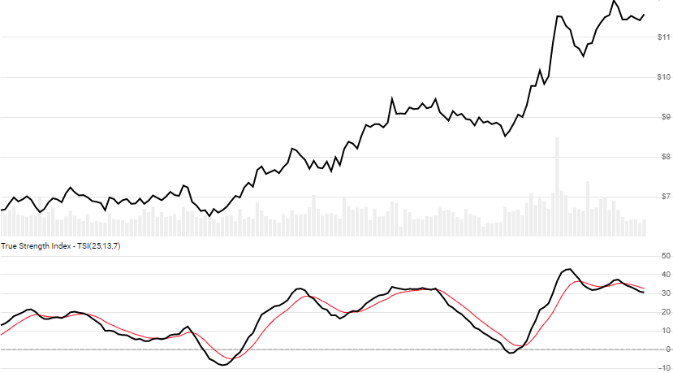

# True Strength Index (TSI)

Created by William Blau, the [True Strength Index](https://en.wikipedia.org/wiki/True_strength_index) is a momentum oscillator that depicts trends in price changes.
[[Discuss] :speech_balloon:](https://github.com/DaveSkender/Stock.Indicators/discussions/300 "Community discussion about this indicator")



```csharp
// usage
IEnumerable<TsiResult> results = 
  Indicator.GetTsi(history, lookbackPeriod, smoothPeriod, signalPeriod);  
```

## Parameters

| name | type | notes
| -- |-- |--
| `history` | IEnumerable\<[TQuote](../../docs/GUIDE.md#historical-quotes)\> | Historical price quotes should have a consistent frequency (day, hour, minute, etc).
| `lookbackPeriod` | int | Number of periods (`N`) for the first EMA.  Must be greater than 0.  Default is 25.
| `smoothPeriod` | int | Number of periods (`M`) for the second smoothing.  Must be greater than 0.  Default is 13.
| `signalPeriod` | int | Number of periods (`S`) in the TSI moving average.  Must be greater than or equal to 0.  Default is 7.

### Minimum history requirements

You must supply at least `N+M+100` periods of `history`.  Since this uses a two EMA smoothing techniques, we recommend you use at least `N+M+250` data points prior to the intended usage date for better precision.

## Response

```csharp
IEnumerable<TsiResult>
```

The first `N+M-1` periods will have `null` values since there's not enough data to calculate.  `Signal` will be `null` for all periods if `signalPeriod=0`.  We always return the same number of elements as there are in the historical quotes.

:warning: **Warning**: The first `N+M+250` periods will have decreasing magnitude, convergence-related precision errors that can be as high as ~5% deviation in indicator values for earlier periods.

### TsiResult

| name | type | notes
| -- |-- |--
| `Date` | DateTime | Date
| `Tsi` | decimal | True Strength Index
| `Signal` | decimal | Signal line (EMA of TSI)

## Example

```csharp
// fetch historical quotes from your favorite feed, in Quote format
IEnumerable<Quote> history = GetHistoryFromFeed("MSFT");

// calculate 20-period TSI
IEnumerable<TsiResult> results = Indicator.GetTsi(history,25,13,7);

// use results as needed
TsiResult result = results.LastOrDefault();
Console.WriteLine("TSI on {0} was {1}", result.Date, result.Tsi);
```

```bash
TSI on 12/31/2018 was -28.35
```
