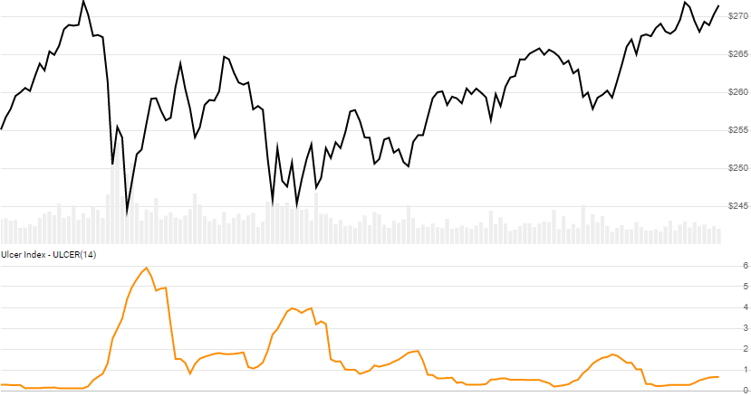

# Ulcer Index (UI)

Created by Peter Martin, the [Ulcer Index](https://en.wikipedia.org/wiki/Ulcer_index) is a measure of downside Close price volatility over a lookback window.
[[Discuss] :speech_balloon:](https://github.com/DaveSkender/Stock.Indicators/discussions/232 "Community discussion about this indicator")



```csharp
// usage
IEnumerable<UlcerIndexResult> results =
  history.GetUlcerIndex(lookbackPeriod);  
```

## Parameters

| name | type | notes
| -- |-- |--
| `lookbackPeriod` | int | Number of periods (`N`) for review.  Must be greater than 0.  Default is 14.

### Historical quotes requirements

You must have at least `N` periods of `history`.

`history` is an `IEnumerable<TQuote>` collection of historical price quotes.  It should have a consistent frequency (day, hour, minute, etc).  See [the Guide](../../docs/GUIDE.md) for more information.

## Response

```csharp
IEnumerable<UlcerIndexResult>
```

The first `N-1` slow periods + signal period will have `null` values since there's not enough data to calculate.  We always return the same number of elements as there are in the historical quotes.

### UlcerIndexResult

| name | type | notes
| -- |-- |--
| `Date` | DateTime | Date
| `UI` | decimal | Ulcer Index

## Example

```csharp
// fetch historical quotes from your feed (your method)
IEnumerable<Quote> history = GetHistoryFromFeed("SPY");

// calculate UI(14)
IEnumerable<UlcerIndexResult> results = history.GetUlcerIndex(14);

// use results as needed
UlcerIndexResult result = results.LastOrDefault();
Console.WriteLine("Ulcer Index on {0} was {1}", result.Date, result.UI);
```

```bash
Ulcer Index on 12/31/2018 was 5.73
```
