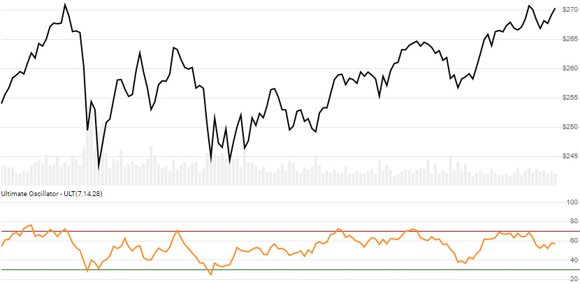

# Ultimate Oscillator

[Ultimate Oscillator](https://en.wikipedia.org/wiki/Ultimate_oscillator) uses several lookback periods to weigh buying power against true range price to produce on oversold / overbought oscillator.



```csharp
// usage
IEnumerable<UltimateResult> results = Indicator.GetUltimate(history, shortPeriod, middlePeriod, longPeriod);  
```

## Parameters

| name | type | notes
| -- |-- |--
| `history` | IEnumerable\<[TQuote](../../docs/GUIDE.md#quote)\> | Historical Quotes data should be at any consistent frequency (day, hour, minute, etc).  You must supply at least `L+1` periods of `history`.
| `shortPeriod` | int | Number of periods (`S`) in the short lookback.  Must be greater than 0.  Default is 7.
| `middlePeriod` | int | Number of periods (`M`) in the middle lookback.  Must be greater than `S`.  Default is 14.
| `longPeriod` | int | Number of periods (`L`) in the long lookback.  Must be greater than `M`.  Default is 28.

## Response

```csharp
IEnumerable<UltimateResult>
```

The first `L-1` periods will have `null` Ultimate values since there's not enough data to calculate.  We always return the same number of elements as there are in the historical quotes.

### UltimateResult

| name | type | notes
| -- |-- |--
| `Date` | DateTime | Date
| `Ultimate` | decimal | Simple moving average for `N` lookback periods

## Example

```csharp
// fetch historical quotes from your favorite feed, in Quote format
IEnumerable<Quote> history = GetHistoryFromFeed("MSFT");

// calculate 20-period Ultimate
IEnumerable<UltimateResult> results = Indicator.GetUltimate(history,7,14,28);

// use results as needed
DateTime evalDate = DateTime.Parse("12/31/2018");
UltimateResult result = results.Where(x=>x.Date==evalDate).FirstOrDefault();
Console.WriteLine("ULT on {0} was {1}", result.Date, result.Ultimate);
```

```bash
ULT on 12/31/2018 was 49.53
```
