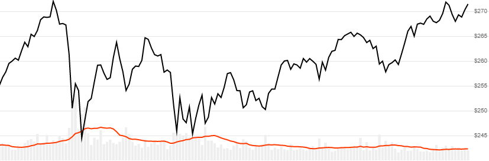

# Volume Simple Moving Average

The Volume Simple Moving Average is the average volume over a lookback window.  This is helpful when you are trying to assess whether volume is above or below normal.
[[Discuss] :speech_balloon:](https://github.com/DaveSkender/Stock.Indicators/discussions/230 "Community discussion about this indicator")



```csharp
// usage
IEnumerable<VolSmaResult> results = Indicator.GetVolSma(history, lookbackPeriod);  
```

## Parameters

| name | type | notes
| -- |-- |--
| `history` | IEnumerable\<[TQuote](../../docs/GUIDE.md#historical-quotes)\> | Historical price quotes should have a consistent frequency (day, hour, minute, etc).
| `lookbackPeriod` | int | Number of periods (`N`) in the moving average.  Must be greater than 0.

### Minimum history requirements

You must supply at least `N` periods of `history`.

## Response

```csharp
IEnumerable<VolSmaResult>
```

The first `N-1` periods will have `null` values for `VolSma` since there's not enough data to calculate.  We always return the same number of elements as there are in the historical quotes.

### VolSmaResult

| name | type | notes
| -- |-- |--
| `Date` | DateTime | Date
| `Volume` | decimal | Volume
| `VolSma` | decimal | Simple moving average of `Volume` for `N` lookback periods

## Example

```csharp
// fetch historical quotes from your favorite feed, in Quote format
IEnumerable<Quote> history = GetHistoryFromFeed("MSFT");

// calculate 20-period SMA of Volume
IEnumerable<VolSmaResult> results = Indicator.GetVolSma(history,20);

// use results as needed
VolSmaResult result = results.LastOrDefault();
Console.WriteLine("Average Volume on {0} was {1}", result.Date, result.VolSma);
```

```bash
Average Volume on 12/31/2018 was 163695200
```
