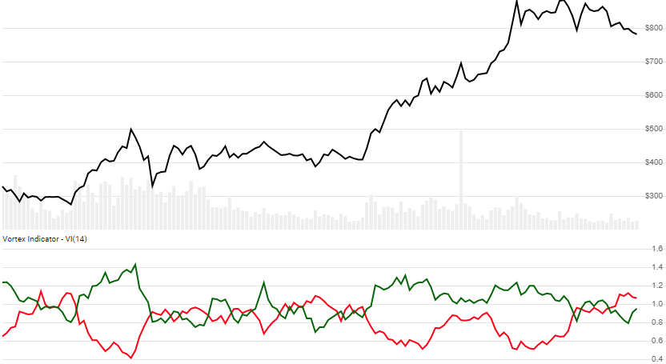

# Vortex Indicator (VI)

Created by Etienne Botes and Douglas Siepman, the [Vortex Indicator](https://en.wikipedia.org/wiki/Vortex_indicator) is a measure of price directional movement.  It includes positive and negative indicators, and is often used to identify trends and reversals.
[[Discuss] :speech_balloon:](https://github.com/DaveSkender/Stock.Indicators/discussions/339 "Community discussion about this indicator")



```csharp
// usage
IEnumerable<VortexResult> results
  = Indicator.GetVortex(history, lookbackPeriod);  
```

## Parameters

| name | type | notes
| -- |-- |--
| `history` | IEnumerable\<[TQuote](../../docs/GUIDE.md#historical-quotes)\> | Historical price quotes should have a consistent frequency (day, hour, minute, etc).
| `lookbackPeriod` | int | Number of periods (`N`) to consider.  Must be greater than 1 and is usually between 14 and 30.

### Minimum history requirements

You must supply at least `N+1` periods of `history`.

## Response

```csharp
IEnumerable<VortexResult>
```

The first `N` periods will have `null` values for VI since there's not enough data to calculate.  We always return the same number of elements as there are in the historical quotes.

### VortexResult

| name | type | notes
| -- |-- |--
| `Date` | DateTime | Date
| `Pvi` | decimal | Positive Vortex Indicator (VI+)
| `Nvi` | decimal | Negative Vortex Indicator (VI-)

## Example

```csharp
// fetch historical quotes from your favorite feed, in Quote format
IEnumerable<Quote> history = GetHistoryFromFeed("SPY");

// calculate 14-period VI
IEnumerable<VortexResult> results = Indicator.GetVortex(history,14);

// use results as needed
VortexResult result = results.LastOrDefault();
Console.WriteLine("VI+ on {0} was {1}", result.Date, result.Pvi);
```

```bash
VI+ on 12/31/2018 was 0.871
```
