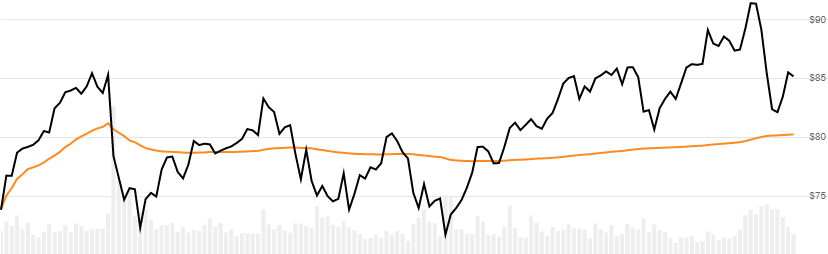

# Volume Weighted Average Price (VWAP)

The [Volume Weighted Average Price](https://en.wikipedia.org/wiki/Volume-weighted_average_price) is a Volume weighted average of Close price, typically used on intraday data.
[[Discuss] :speech_balloon:](https://github.com/DaveSkender/Stock.Indicators/discussions/310 "Community discussion about this indicator")



```csharp
// usage
IEnumerable<VwapResult> results =
  history.GetVwap();

// usage with optional anchored start date
IEnumerable<VwapResult> results =
  history.GetVwap(startDate);  
```

## Parameters

| name | type | notes
| -- |-- |--
| `startDate` | DateTime | Optional.  The anchor date used to start the VWAP accumulation.  The earliest date in `history` is used when not provided.

### Historical quotes requirements

You must have at least one historical quote to calculate; however, more is often needed to be useful.  History is typically provided for a single day using minute-based intraday periods.  Since this is an accumulated weighted average price, different start dates will produce different results.  The accumulation starts at the first period in the provided `history`, unless it is specified in the optional `startDate` parameter.

`history` is an `IEnumerable<TQuote>` collection of historical price quotes.  It should have a consistent frequency (day, hour, minute, etc).  See [the Guide](../../docs/GUIDE.md) for more information.

## Response

```csharp
IEnumerable<VwapResult>
```

The first period or the `startDate` will have a `Vwap = Close` value since it is the initial starting point.  `Vwap` values before `startDate`, if specified, will be `null`.  We always return the same number of elements as there are in the historical quotes.

### VwapResult

| name | type | notes
| -- |-- |--
| `Date` | DateTime | Date
| `Vwap` | decimal | Volume Weighted Average Price

## Example

```csharp
// fetch historical quotes from your feed (your method)
IEnumerable<Quote> history = GetHistoryFromFeed("SPY");

// calculate
IEnumerable<VwapResult> results = history.GetVwap();

// use results as needed
VwapResult result = results.LastOrDefault();
Console.WriteLine("VWAP on {0} was ${1}", result.Date, result.Vwap);
```

```bash
VWAP on 12/15/2020 16:00:00 was $368.18
```
