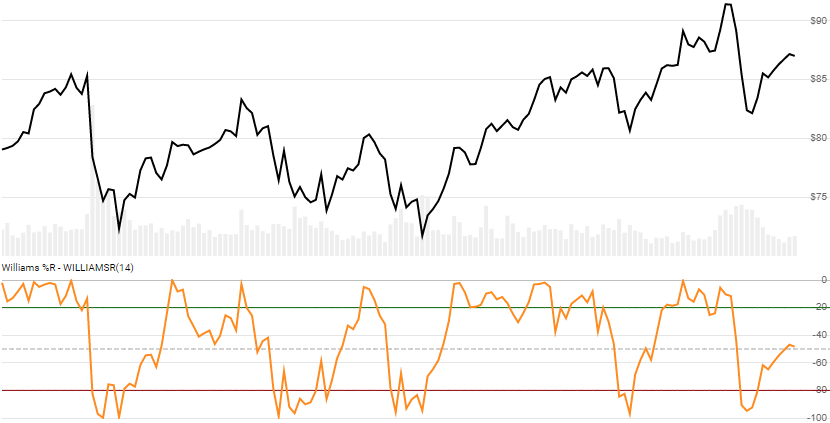

# Williams %R

Created by Larry Williams, the [Williams %R](https://en.wikipedia.org/wiki/Williams_%25R) momentum indicator is a stochastic oscillator with scale of -100 to 0.  It is exactly the same as the Fast variant of [Stochastic Oscillator](../Stochastic/README.md), but with a different scaling.
[[Discuss] :speech_balloon:](https://github.com/DaveSkender/Stock.Indicators/discussions/229 "Community discussion about this indicator")



```csharp
// usage
IEnumerable<WilliamsResult> results = Indicator.GetWilliamsR(history, lookbackPeriod);  
```

## Parameters

| name | type | notes
| -- |-- |--
| `history` | IEnumerable\<[TQuote](../../docs/GUIDE.md#historical-quotes)\> | Historical price quotes should have a consistent frequency (day, hour, minute, etc).
| `lookbackPeriod` | int | Number of periods (`N`) in the lookback period.  Must be greater than 0.  Default is 14.

### Minimum history requirements

You must supply at least `N` periods of `history`.

## Response

```csharp
IEnumerable<WilliamsResult>
```

The first `N-1` periods will have `null` Oscillator values since there's not enough data to calculate.  We always return the same number of elements as there are in the historical quotes.

### WilliamsResult

| name | type | notes
| -- |-- |--
| `Date` | DateTime | Date
| `WilliamsR` | decimal | Oscillator over prior `N` lookback periods

## Example

```csharp
// fetch historical quotes from your favorite feed, in Quote format
IEnumerable<Quote> history = GetHistoryFromFeed("SPY");

// calculate WilliamsR(14)
IEnumerable<WilliamsResult> results = Indicator.GetWilliamsR(history,14);

// use results as needed
WilliamsResult result = results.LastOrDefault();
Console.WriteLine("Williams %R on {0} was {1}", result.Date, result.WilliamsR);
```

```bash
Williams %R on 12/31/2018 was -52.0
```
