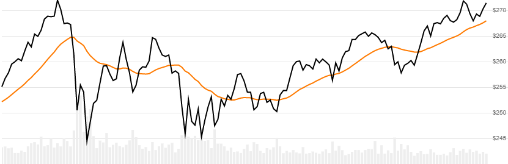

# [Linear] Weighted Moving Average (WMA)

[Weighted Moving Average](https://en.wikipedia.org/wiki/Moving_average#Weighted_moving_average) is the linear weighted average of `Close` price over `N` lookback periods.  This also called Linear Weighted Moving Average (LWMA).
[[Discuss] :speech_balloon:](https://github.com/DaveSkender/Stock.Indicators/discussions/227 "Community discussion about this indicator")



```csharp
// usage
IEnumerable<WmaResult> results =
  quotes.GetWma(lookbackPeriods);  
```

## Parameters

| name | type | notes
| -- |-- |--
| `lookbackPeriods` | int | Number of periods (`N`) in the moving average.  Must be greater than 0.

### Historical quotes requirements

You must have at least `N` periods of `quotes`.

`quotes` is an `IEnumerable<TQuote>` collection of historical price quotes.  It should have a consistent frequency (day, hour, minute, etc).  See [the Guide](../../docs/GUIDE.md) for more information.

## Response

```csharp
IEnumerable<WmaResult>
```

The first `N-1` periods will have `null` values since there's not enough data to calculate.  We always return the same number of elements as there are in the historical quotes.

### WmaResult

| name | type | notes
| -- |-- |--
| `Date` | DateTime | Date
| `Wma` | decimal | Weighted moving average for `N` lookback periods

### Utilities

- [.Find()](../../docs/UTILITIES.md#find-indicator-result-by-date)
- [.PruneWarmupPeriods()](../../docs/UTILITIES.md#prune-warmup-periods)
- [.PruneWarmupPeriods(qty)](../../docs/UTILITIES.md#prune-warmup-periods)

See [Utilities and Helpers](../../docs/UTILITIES.md#content) for more information.

## Example

```csharp
// fetch historical quotes from your feed (your method)
IEnumerable<Quote> quotes = GetHistoryFromFeed("MSFT");

// calculate 20-period WMA
IEnumerable<WmaResult> results = quotes.GetWma(20);

// use results as needed
WmaResult result = results.LastOrDefault();
Console.WriteLine("WMA on {0} was ${1}", result.Date, result.Wma);
```

```bash
WMA on 12/31/2018 was $235.53
```
