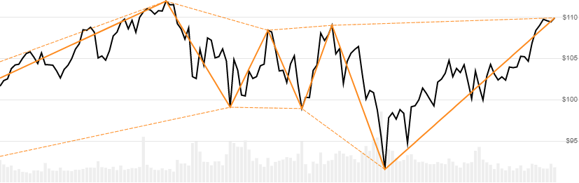

# Zig Zag

[Zig Zag](https://school.stockcharts.com/doku.php?id=technical_indicators:zigzag) is a price chart overlay that simplifies the up and down movements and transitions based on a percent change smoothing threshold.
[[Discuss] :speech_balloon:](https://github.com/DaveSkender/Stock.Indicators/discussions/226 "Community discussion about this indicator")



```csharp
// usage
IEnumerable<ZigZagResult> results =
  Indicator.GetZigZag(history, type, percentChange);  
```

## Parameters

| name | type | notes
| -- |-- |--
| `history` | IEnumerable\<[TQuote](../../docs/GUIDE.md#historical-quotes)\> | Historical price quotes should have a consistent frequency (day, hour, minute, etc).
| `type` | ZigZagType | Determines whether `Close` or `High/Low` are used to measure percent change.  See [ZigZagType options](#zigzagtype-options) below.  Default is `ZigZagType.Close`.
| `percentChange` | decimal | Percent change required to establish a line endpoint.  Example: 3.5% would be entered as 3.5 (not 0.035).  Must be greater than 0.  Typical values range from 3 to 10.  Default is 5.

### Minimum history requirements

You must supply at least two periods of `history` to calculate, but notably more is needed to be useful.

### ZigZagType options

| type | description
|-- |--
| `ZigZagType.Close` | Percent change measured from `Close` price (default)
| `ZigZagType.HighLow` | Percent change measured from `High` and `Low` price

## Response

```csharp
IEnumerable<ZigZagResult>
```

If you do not supply enough points to cover the percent change, there will be no valid Zig Zag points or lines.  The first line segment starts after the first confirmed point; ZigZag values before the first confirmed point will be `null`.  The last line segment is an approximation as the direction is indeterminant.  Swing high and low points are denoted with `PointType` values of `H` or `L`.  We always return the same number of result elements as there are in the historical quotes.

### ZigZagResult

| name | type | notes
| -- |-- |--
| `Date` | DateTime | Date
| `ZigZag` | decimal | Zig Zag line for `percentChange`
| `PointType` | string | Zig Zag endpoint type (`H` for high point, `L` for low point)
| `RetraceHigh` | decimal | Retrace line for high points
| `RetraceLow` | decimal | Retrace line for low points

## Example

```csharp
// fetch historical quotes from your favorite feed, in Quote format
IEnumerable<Quote> history = GetHistoryFromFeed("SPY");

// calculate 3% change ZIGZAG
IEnumerable<ZigZagResult> results =
  Indicator.GetZigZag(history,ZigZagType.Close,3);

// use results as needed
ZigZagResult result = results.LastOrDefault();
Console.WriteLine("ZIGZAG on {0} was ${1}", result.Date, result.ZigZag);
```

```bash
ZIGZAG on 02/18/2018 was $248.13
```
