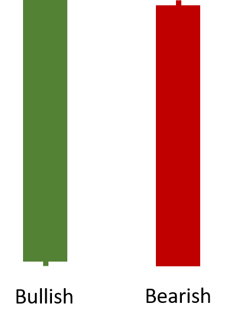

# Marubozu | Candlestick Pattern

[Marubozu](https://en.wikipedia.org/wiki/Marubozu) is a candlestick pattern that has no wicks, representing consistent directional movement.
[[Discuss] :speech_balloon:](https://github.com/DaveSkender/Stock.Indicators/discussions/512 "Community discussion about this indicator")

  

```csharp
// usage
IEnumerable<MarubozuResult> results =
  quotes.GetMarubozu(minBodyPercent);
```

## Parameters

| name | type | notes
| -- |-- |--
| `minBodyPercent` | double | Optional.  Minimum body size as a decimalized percent of total candle size.  Must be greater than 0, if specified.  Default is 0.95 (e.g. 95%).

### Historical quotes requirements

You must have at least one historical quote.

`quotes` is an `IEnumerable<TQuote>` collection of historical price quotes.  It should have a consistent frequency (day, hour, minute, etc).  See [the Guide](../../docs/GUIDE.md#historical-quotes) for more information.

## Response

```csharp
IEnumerable<MarubozuResult>
```

We always return the same number of elements as there are in the historical quotes.

### MarubozuResult

| name | type | notes
| -- |-- |--
| `Date` | DateTime | Date
| `Marubozu` | decimal | Indicates a Marubozu candle `Close` price; otherwise `null`
| `IsBullish` | bool | Direction of the candle

### Utilities

- [.Find(lookupDate)](../../docs/UTILITIES.md#find-indicator-result-by-date)
- [.RemoveWarmupPeriods(qty)](../../docs/UTILITIES.md#remove-warmup-periods)

See [Utilities and Helpers](../../docs/UTILITIES.md#content) for more information.

## Example

```csharp
// fetch historical quotes from your feed (your method)
IEnumerable<Quote> quotes = GetHistoryFromFeed("SPY");

// calculate
IEnumerable<MarubozuResult> results = quotes.GetMarubozu();

// use results as needed
MarubozuResult result = results.LastOrDefault();
Console.WriteLine("Marubozu on {0} was ${1}", result.Date, result.Marubozu);
```

```bash
Marubozu on 12/31/2018 was $205.34
```
