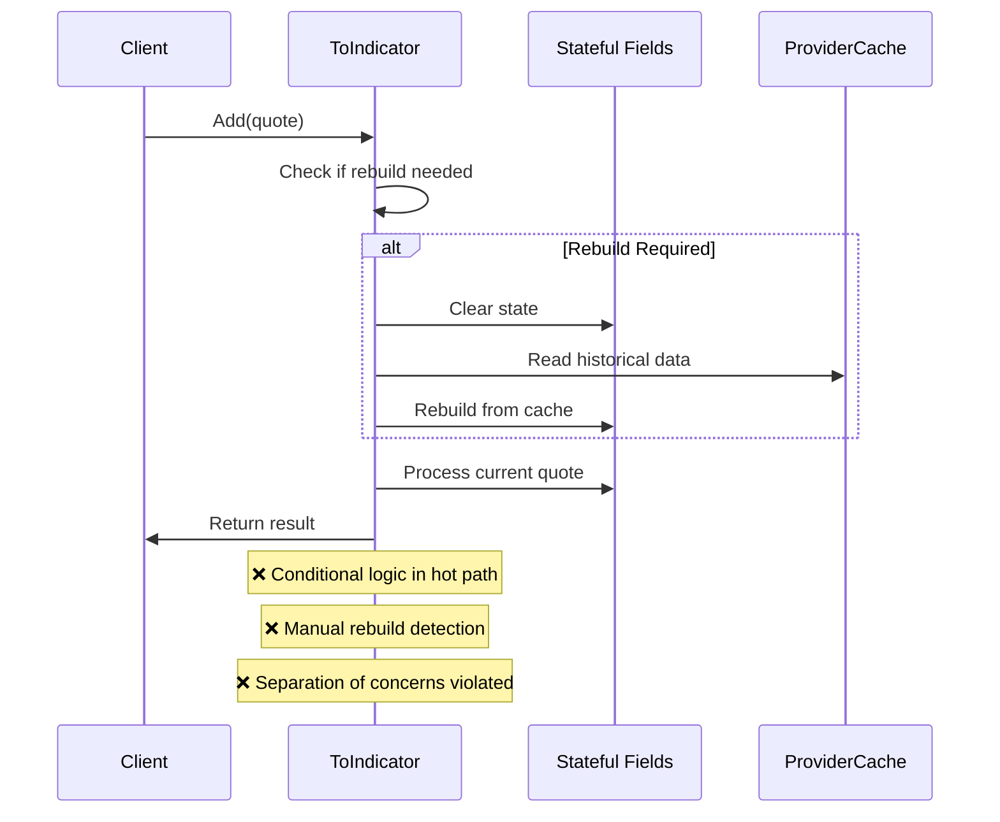
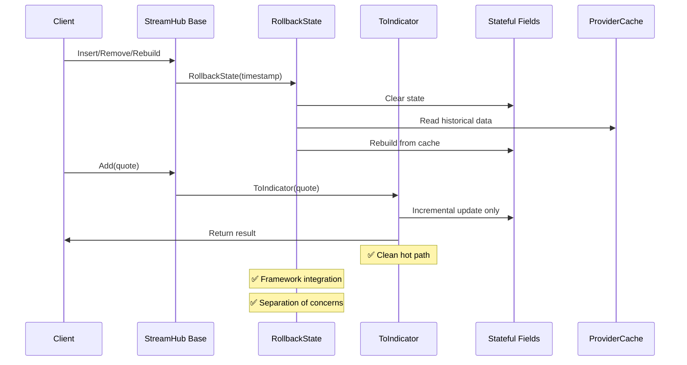

# Technical Plan: Missing RollbackState Overrides

**Feature ID**: 003-implement-missing-rollback-overrides  
**Status**: Ready for Implementation  
**Created**: 2025-10-25  
**Last Updated**: 2025-10-25

---

## Overview

This plan outlines the technical implementation strategy for adding proper `RollbackState` method overrides to 2 StreamHub implementations that currently use inline rebuild logic instead of the framework-integrated rollback pattern.

---

## Tech Stack

### Core Technologies

- **.NET 8.0 / 9.0** - Multi-target framework
- **C# 12** - Primary language with nullable reference types enabled
- **xUnit** - Testing framework
- **BenchmarkDotNet** - Performance testing

### Libraries & Frameworks

- **Stock.Indicators** - Core library (this repository)
- **System.Collections.Generic** - `Queue<T>`, `List<T>` for state management
- **StreamHub Base Class** - Provides `RollbackState` virtual method
- **ProviderCache** - Quote cache for state rebuilding

### Development Tools

- **Visual Studio Code** - IDE with dev container
- **EditorConfig** - Code formatting rules
- **Roslyn Analyzers** - Code quality enforcement
- **Markdownlint** - Documentation linting

---

## Architecture

### Current Architecture (Inline Rebuild - WRONG)



### Target Architecture (RollbackState - CORRECT)



---

## Project Structure

### Files to Modify

```text
src/
├── a-d/
│   ├── Cci/
│   │   └── Cci.StreamHub.cs          [MODIFY] Add RollbackState, simplify ToIndicator
│   └── Cmo/
│       └── Cmo.StreamHub.cs          [MODIFY] Add RollbackState, remove inline rebuild
│
tests/
└── indicators/
    ├── a-d/
    │   ├── Cci/
    │   │   └── Cci.StreamHub.Tests.cs    [MODIFY] Add rollback test scenarios
    │   └── Cmo/
    │       └── Cmo.StreamHub.Tests.cs    [MODIFY] Add rollback test scenarios
    │
    └── _common/
        └── StreamHubTestBase.cs          [REFERENCE] Base class with helper methods

.github/
└── instructions/
    └── indicator-stream.instructions.md  [UPDATE] Add new reference implementations

specs/
└── 003-implement-missing-rollback-overrides/
    ├── spec.md                           [NEW] This feature spec
    ├── plan.md                           [NEW] This technical plan
    └── tasks.md                          [NEW] Implementation tasks
```

---

## Implementation Strategy

### Phase 1: CMO Implementation (Simple Buffer Management)

**Goal**: Establish pattern with simpler stateful field (single Queue).

#### State Analysis

**Current State**:

```csharp
private readonly Queue<(bool? isUp, double value)> _tickBuffer;
```

**Rebuild Logic** (currently inline):

```csharp
bool canIncrement = Cache.Count > i
    && _tickBuffer.Count == LookbackPeriods
    && Cache[i - 1].Cmo.HasValue;

if (canIncrement)
{
    // Incremental update
}
else
{
    // Rebuild _tickBuffer from ProviderCache
}
```

#### Implementation Approach

1. **Add RollbackState Method**:

   ```csharp
   protected override void RollbackState(DateTime timestamp)
   {
       _tickBuffer.Clear();
       
       int index = ProviderCache.IndexGte(timestamp);
       if (index <= 0) return;
       
       int targetIndex = index - 1;
       int startIdx = Math.Max(0, targetIndex + 1 - LookbackPeriods);
       
       for (int p = startIdx; p <= targetIndex; p++)
       {
           double prevValue = ProviderCache[p - 1].Value;
           double currValue = ProviderCache[p].Value;
           double tickValue = Math.Abs(currValue - prevValue);
           bool? isUp = double.IsNaN(tickValue) || currValue == prevValue
               ? null
               : currValue > prevValue;
           _tickBuffer.Enqueue((isUp, tickValue));
       }
   }
   ```

2. **Simplify ToIndicator**:
   - Remove `canIncrement` check
   - Remove else-branch rebuild logic
   - Keep only incremental update path
   - Use `_tickBuffer.Update(LookbackPeriods, ...)` for rolling behavior

3. **Test Strategy**:
   - Write rollback tests BEFORE implementation (TDD)
   - Follow EmaHub test pattern exactly
   - Validate Series parity after rollback operations

---

### Phase 2: CCI Implementation (Complex List State)

**Goal**: Apply pattern to more complex stateful structure (CciList with internal buffers).

#### State Analysis

**Current State**:

```csharp
private readonly CciList _cciList;
```

**CciList Internals** (from BufferList-style implementation):

- Rolling SMA calculation buffer
- Mean deviation calculation buffer
- Typical price storage

**Current Synchronization Logic** (inline):

```csharp
if (i == 0)
    _cciList.Clear(); _cciList.Add(item);
else if (_cciList.Count == i)
    _cciList.Add(item);
else if (_cciList.Count < i)
    // Rebuild missing items
else // _cciList.Count > i
    // Rebuild from scratch
```

#### Implementation Approach

1. **Add RollbackState Method**:

   ```csharp
   protected override void RollbackState(DateTime timestamp)
   {
       _cciList.Clear();
       
       int index = ProviderCache.IndexGte(timestamp);
       if (index <= 0) return;
       
       int targetIndex = index - 1;
       
       for (int p = 0; p <= targetIndex; p++)
       {
           IQuote quote = ProviderCache[p];
           _cciList.Add(quote);
       }
   }
   ```

2. **Simplify ToIndicator**:
   - Remove ALL state synchronization logic
   - Reduce to:

     ```csharp
     _cciList.Add(item);
     CciResult r = _cciList[^1];
     return (r, i);
     ```

3. **Test Strategy**:
   - Write rollback tests following CMO/EMA pattern
   - Validate CciList internal state consistency
   - Ensure Series parity maintained

---

### Phase 3: Rolling Window Utility Refactorings

**Goal**: Optimize performance by replacing O(n) linear scans with O(1) amortized RollingWindowMax/Min utilities.

#### Utility Overview

**RollingWindowMax<T>** and **RollingWindowMin<T>**:

- Location: `src/_common/StreamHub/RollingWindowMax.cs`, `RollingWindowMin.cs`
- Data Structure: Monotonic deque (LinkedList + Queue)
- Time Complexity: O(1) amortized for Add and Max/Min operations
- Space Complexity: O(capacity)
- Already used by: ChandelierHub, StochHub

#### Refactoring Candidates

**Priority 1 (Simple - High Impact)**:

1. **DonchianHub** (`src/a-d/Donchian/Donchian.StreamHub.cs`)
   - Replace: Linear scan through lookback period for high/low
   - Add: `_highWindow`, `_lowWindow` (decimal)
   - State: Add RollbackState override (currently none)
   - Benefit: 10-50x speedup for large lookback periods

2. **WilliamsRHub** (`src/s-z/WilliamsR/WilliamsR.StreamHub.cs`)
   - Replace: Linear scan through lookback period for high/low
   - Add: `_highWindow`, `_lowWindow` (double)
   - State: Add RollbackState override (currently none)
   - Benefit: 10-50x speedup, consistency with Stoch pattern

**Priority 2 (Moderate - Good Impact)**:

3. **FisherTransformHub** (`src/e-k/FisherTransform/FisherTransform.StreamHub.cs`)
   - Replace: Linear scan for HL2 price min/max
   - Add: `_priceMaxWindow`, `_priceMinWindow` (double)
   - State: Update existing RollbackState to include windows
   - Benefit: Cleaner code, O(1) price window

4. **ChopHub** (`src/a-d/Chop/Chop.StreamHub.cs`)
   - Replace: Linear scan for true high/low max/min
   - Add: `_trueHighWindow`, `_trueLowWindow` (double)
   - State: Add RollbackState override (currently none)
   - Challenge: Must calculate true high/low incrementally
   - Benefit: Significant speedup for large lookback

5. **StochRsiHub** (`src/s-z/StochRsi/StochRsi.StreamHub.cs`)
   - Replace: Foreach loop over Queue for RSI min/max
   - Add: Replace Queue with `_rsiMaxWindow`, `_rsiMinWindow`
   - State: Update existing RollbackState to include windows
   - Benefit: Cleaner internal state, O(1) vs O(n) foreach

#### Implementation Pattern

**Before (O(n))**:

```csharp
double max = double.MinValue;
double min = double.MaxValue;

for (int p = i - LookbackPeriods; p < i; p++)
{
    double value = ProviderCache[p].SomeValue;
    if (value > max) max = value;
    if (value < min) min = value;
}
```

**After (O(1) amortized)**:

```csharp
// In constructor:
_maxWindow = new RollingWindowMax<double>(lookbackPeriods);
_minWindow = new RollingWindowMin<double>(lookbackPeriods);

// In ToIndicator:
_maxWindow.Add(item.SomeValue);
_minWindow.Add(item.SomeValue);

if (i >= LookbackPeriods - 1)
{
    double max = _maxWindow.Max;
    double min = _minWindow.Min;
    // ... calculation
}

// In RollbackState:
protected override void RollbackState(DateTime timestamp)
{
    _maxWindow.Clear();
    _minWindow.Clear();
    
    int index = ProviderCache.IndexGte(timestamp);
    if (index <= 0) return;
    
    int targetIndex = index - 1;
    int startIdx = Math.Max(0, targetIndex + 1 - LookbackPeriods);
    
    for (int p = startIdx; p <= targetIndex; p++)
    {
        double value = ProviderCache[p].SomeValue;
        _maxWindow.Add(value);
        _minWindow.Add(value);
    }
}
```

#### Performance Expectations

| Indicator | Current | After Refactoring | Expected Improvement |
|-----------|---------|-------------------|----------------------|
| Donchian (period=20) | O(20) per update | O(1) amortized | 20x faster |
| Donchian (period=100) | O(100) per update | O(1) amortized | 100x faster |
| Williams %R (period=14) | O(14) per update | O(1) amortized | 14x faster |
| Fisher (period=10) | O(10) per update | O(1) amortized | 10x faster |
| Chop (period=14) | O(14) per update | O(1) amortized | 14x faster |
| Stoch RSI | O(n) foreach | O(1) property | Moderate improvement |

---

## Testing Strategy

### Test Coverage Requirements

Per [indicator-stream.instructions.md](../../.github/instructions/indicator-stream.instructions.md#comprehensive-rollback-validation-required):

**Required Test Scenarios** (5 per indicator):

1. **Warmup Prefill** (`RollbackFromEmptyState_ShouldHandleWarmupPeriod`)
   - Start from empty state
   - Add quotes up to warmup period
   - Trigger rollback
   - Verify state properly restored

2. **Duplicate Arrivals** (`DuplicateArrivals_ShouldMaintainConsistentState`)
   - Add same quote multiple times
   - Verify state remains consistent
   - No duplicate processing errors

3. **Provider History Insert** (`ProviderHistoryInsert_ShouldRebuildState`)
   - Insert historical quote into ProviderCache
   - Trigger RollbackState automatically
   - Verify state rebuilt correctly from cache

4. **Provider History Remove** (`ProviderHistoryRemove_ShouldRebuildState`)
   - Remove quote from ProviderCache
   - Trigger RollbackState automatically
   - Verify state consistency after removal

5. **Series Parity** (`RollbackResults_ShouldMatchSeriesBaseline`)
   - Execute rollback scenarios
   - Compare results with Series baseline
   - Assert bit-for-bit equality

### Test Implementation Pattern

```csharp
public class CmoStreamHubRollbackTests : StreamHubTestBase
{
    [Fact]
    public void RollbackFromEmptyState_ShouldHandleWarmupPeriod()
    {
        // Arrange
        var hub = new CmoHub(14);
        var quotes = TestData.GetDefault();
        
        // Act: Add warmup quotes
        hub.Add(quotes.Take(14));
        
        // Act: Trigger rollback by inserting earlier quote
        // (Framework will call RollbackState automatically)
        
        // Assert: Verify state restored correctly
    }
    
    [Fact]
    public void ProviderHistoryInsert_ShouldRebuildBuffer()
    {
        // Use helper from StreamHubTestBase
        ProviderHistoryTesting<CmoHub, CmoResult>(
            /* setup parameters */
        );
    }
    
    [Fact]
    public void RollbackResults_ShouldMatchSeriesBaseline()
    {
        // Use helper from StreamHubTestBase
        AssertSeriesParity<CmoHub, CmoResult>(
            /* setup parameters */
        );
    }
}
```

### Regression Testing

- **Unit Tests**: `dotnet test --settings tests/tests.unit.runsettings`
- **Regression Tests**: `dotnet test --settings tests/tests.regression.runsettings`
- **Performance Tests**: `dotnet run --project tools/performance/Tests.Performance.csproj -c Release`

---

## Performance Considerations

### Expected Performance Improvements

1. **Hot Path Optimization**:
   - Remove conditional logic from `ToIndicator`
   - Reduce branching in performance-critical path
   - Simplify incremental update logic

2. **Memory Management**:
   - No change to allocation patterns
   - State clearing/rebuilding only on rollback events (rare)
   - Normal streaming remains allocation-free

3. **Benchmark Targets**:
   - No regression in hot path (< 5% variance)
   - Rollback operations acceptable (infrequent)
   - Overall memory footprint unchanged

### Performance Validation

```bash
# Before implementation
dotnet run --project tools/performance/Tests.Performance.csproj -c Release \
  -- --filter "*CmoHub*|*CciHub*" --exporters json

# After implementation
dotnet run --project tools/performance/Tests.Performance.csproj -c Release \
  -- --filter "*CmoHub*|*CciHub*" --exporters json

# Compare results
# Ensure: Mean time ± 5%, Memory allocations unchanged
```

---

## Code Quality Standards

### Compliance Requirements

- ✅ **EditorConfig**: Follow `.editorconfig` formatting rules
- ✅ **Roslyn Analyzers**: Zero warnings, treat warnings as errors
- ✅ **XML Documentation**: Complete documentation for `RollbackState` methods
- ✅ **Naming Conventions**: Follow established patterns (PascalCase, explicit types)
- ✅ **Nullable Reference Types**: Proper null handling

### Pre-Commit Checklist

Per [source-code-completion.instructions.md](../../.github/instructions/source-code-completion.instructions.md):

- [ ] Code builds without warnings
- [ ] All tests pass (unit, regression, rollback)
- [ ] Code formatted: `dotnet format --verify-no-changes`
- [ ] Markdown linted: `npm run lint:md`
- [ ] Performance benchmarks run (no regressions)
- [ ] Documentation updated

---

## Risk Mitigation

### Risk: Breaking Existing Behavior

**Mitigation**:

- Comprehensive regression test suite
- Series parity validation (bit-for-bit equality)
- Incremental implementation (one indicator at a time)

### Risk: Performance Regression

**Mitigation**:

- Performance benchmarks before/after
- Hot path remains clean (no added complexity)
- Rollback operations only on Insert/Remove (infrequent)

### Risk: Edge Case Handling

**Mitigation**:

- Test warmup periods explicitly
- Test empty state scenarios
- Test boundary conditions (index < lookbackPeriods)
- Follow established patterns from AdxHub, StochHub

---

## Documentation Updates

### Files to Update

1. **`.github/instructions/indicator-stream.instructions.md`**:
   - Add CmoHub to reference implementations list
   - Add CciHub to reference implementations list
   - Update rollback pattern examples if needed

2. **`src/agents.md`** (if applicable):
   - Note: No formula changes, so likely no updates needed
   - Verify mathematical correctness maintained

3. **Spec Kit Artifacts**:
   - Mark feature complete in spec.md
   - Update plan.md with lessons learned
   - Document any deviations from plan

---

## Success Criteria

### Implementation Success

- ✅ Both StreamHubs override `RollbackState` correctly
- ✅ All inline rebuild logic removed from `ToIndicator`
- ✅ Code follows established patterns (AdxHub, StochHub reference)
- ✅ XML documentation complete and accurate

### Testing Success

- ✅ All 5 rollback test scenarios pass per indicator (10 total)
- ✅ All existing regression tests pass
- ✅ Series parity verified (deterministic equality)
- ✅ Performance benchmarks within 5% variance

### Quality Success

- ✅ Zero analyzer warnings
- ✅ Code formatting passes: `dotnet format --verify-no-changes`
- ✅ Markdown linting passes: `npm run lint:md`
- ✅ Full test suite passes: `dotnet test`

### Documentation Success

- ✅ Reference implementations added to instructions
- ✅ Spec Kit artifacts updated and complete
- ✅ Code comments accurate and helpful

---

## Timeline Estimate

**Total Effort**: ~12-16 hours

### Breakdown

- **Phase 1 (CMO)**: 2-3 hours
  - Analysis: 30 min
  - Test writing: 45 min
  - Implementation: 45 min
  - Validation: 30 min

- **Phase 2 (CCI)**: 2-3 hours
  - Analysis: 30 min
  - Test writing: 45 min
  - Implementation: 45 min (more complex)
  - Validation: 30 min

- **Final Validation (Phases 1-2)**: 30-60 min
  - Documentation updates: 20 min
  - Final test runs: 15 min
  - Performance validation: 15 min

- **Phase 3 (Rolling Window Refactorings)**: 7-10 hours
  - Donchian refactoring: 1.5 hours
  - Williams %R refactoring: 1.5 hours
  - Fisher Transform refactoring: 2 hours (has existing RollbackState)
  - Chop refactoring: 2 hours (true high/low complexity)
  - Stoch RSI refactoring: 1.5 hours (existing RollbackState)
  - Performance benchmarking: 1.5 hours

---

## Appendix: Reference Implementations

### Simple: ChandelierHub (Rolling Windows)

```csharp
protected override void RollbackState(DateTime timestamp)
{
    _highWindow.Clear();
    _lowWindow.Clear();
    
    int index = ProviderCache.IndexGte(timestamp);
    if (index <= 0) return;
    
    int targetIndex = index - 1;
    int startIdx = Math.Max(0, targetIndex + 1 - LookbackPeriods);
    
    for (int p = startIdx; p <= targetIndex; p++)
    {
        IQuote quote = ProviderCache[p];
        _highWindow.Add(quote.High);
        _lowWindow.Add(quote.Low);
    }
}
```

### Complex: StochHub (Windows + Buffer Prefill)

```csharp
protected override void RollbackState(DateTime timestamp)
{
    _highWindow.Clear();
    _lowWindow.Clear();
    _rawKBuffer.Clear();
    
    int index = ProviderCache.IndexGte(timestamp);
    if (index <= 0) return;
    
    int targetIndex = index - 1;
    
    // Rebuild windows and buffer
    int windowStart = Math.Max(0, targetIndex + 1 - LookbackPeriods);
    for (int p = windowStart; p <= targetIndex; p++)
    {
        IQuote quote = ProviderCache[p];
        _highWindow.Add(quote.High);
        _lowWindow.Add(quote.Low);
        
        if (p >= LookbackPeriods - 1)
        {
            double rawK = CalculateRawK(quote);
            _rawKBuffer.Enqueue(rawK);
        }
    }
}
```

### Complex: AdxHub (Wilder's Smoothing State)

```csharp
protected override void RollbackState(DateTime timestamp)
{
    int index = ProviderCache.IndexGte(timestamp);
    if (index <= 0) return;
    
    int targetIndex = index - 1;
    
    // Must replay from beginning for Wilder's smoothing
    _prevHigh = 0;
    _prevLow = 0;
    _prevAtr = 0;
    _sumPlusDm = 0;
    _sumMinusDm = 0;
    _prevPlusDi = 0;
    _prevMinusDi = 0;
    _prevAdx = 0;
    
    // Replay entire history to restore Wilder's state
    for (int p = 0; p <= targetIndex; p++)
    {
        // Recalculate all intermediate state...
    }
}
```

---

Last updated: 2025-10-25
