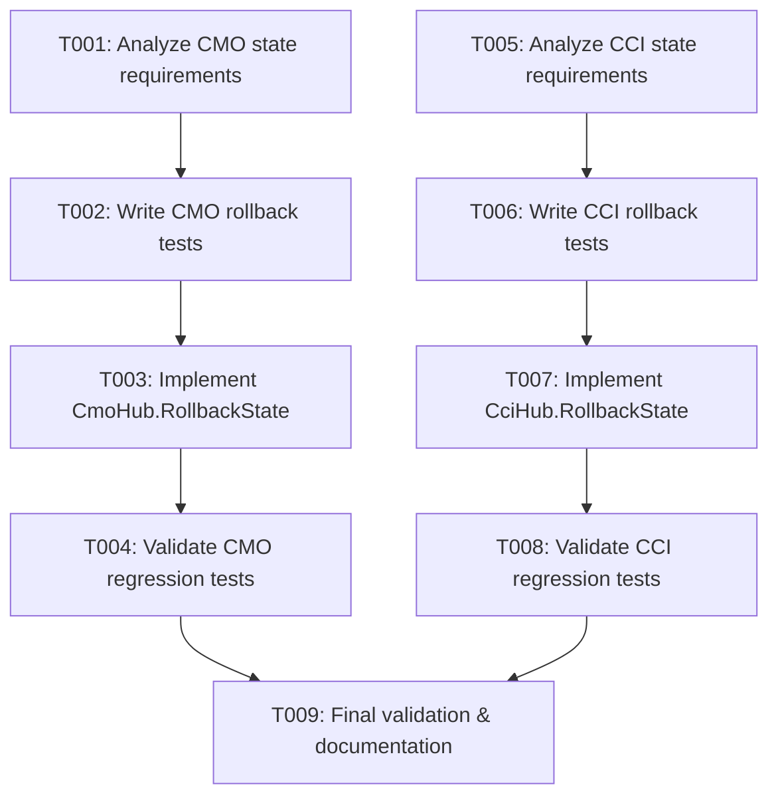

# Implementation Tasks: Missing RollbackState Overrides in StreamHubs

**Feature**: Implement RollbackState overrides for StreamHubs with stateful fields  
**Specification**: [spec.md](./spec.md)  
**Technical Plan**: [plan.md](./plan.md)  
**Status**: Ready for implementation  
**Created**: 2025-10-25

---

## Overview

This document provides actionable tasks to implement missing `RollbackState` method overrides in StreamHub implementations that maintain stateful fields beyond simple cache lookups. Based on recent instruction updates and comprehensive codebase analysis, only **2 StreamHub implementations** require RollbackState implementation:

1. **CmoHub** - Queue-based tick buffer management
2. **CciHub** - CciList internal state synchronization

All other StreamHub implementations (100+ files) either:

- Already have RollbackState implemented (19 implementations)
- Are stateless and rely on Cache/ProviderCache for historical values (majority)

---

## Task Execution Strategy

### Implementation Approach

- **Incremental delivery**: Implement one StreamHub at a time
- **Test-driven**: Write comprehensive rollback tests before implementation
- **Pattern-based**: Follow established patterns from AdxHub, StochHub, ChandelierHub
- **Validation**: Ensure bit-for-bit parity with Series baseline results

### Task Dependencies



### Parallel Execution Opportunities

Within each user story (CMO and CCI are independent):

- Analysis can be done in parallel [P]
- Test writing can be done in parallel [P]
- Implementation must be sequential per indicator
- Final validation must be sequential

---

## Phase 1: Setup & Prerequisites

### T001: Analyze CMO state management requirements [Story: US1] [P]

**File**: `src/a-d/Cmo/Cmo.StreamHub.cs`

**Objective**: Document current state management approach and RollbackState requirements.

**Tasks**:

1. Review current `ToIndicator` implementation and inline rebuild logic
2. Identify stateful fields:
   - `Queue<(bool? isUp, double value)> _tickBuffer` (capacity: lookbackPeriods)
3. Document rebuild scenarios:
   - Insert operation (historical quote added)
   - Remove operation (quote deleted)
   - Explicit Rebuild() call
   - Late arrival processing
4. Map out `_tickBuffer` state restoration strategy:
   - Clear buffer
   - Calculate start position: `i - LookbackPeriods + 1`
   - Iterate through ProviderCache to rebuild ticks
   - Handle edge cases (index < lookbackPeriods)

**Acceptance Criteria**:

- [ ] State fields documented with rebuild requirements
- [ ] Rollback scenarios identified and documented
- [ ] Edge cases identified (warmup period, insufficient data)

**Reference Patterns**:

- `src/s-z/Stoch/Stoch.StreamHub.cs` (buffer management)
- `src/a-d/Chandelier/Chandelier.StreamHub.cs` (rolling window rebuild)

---

### T002: Write comprehensive rollback tests for CMO [Story: US1]

**File**: `tests/indicators/a-d/Cmo/Cmo.StreamHub.Tests.cs`

**Objective**: Create comprehensive rollback validation tests following EMA hub test pattern.

**Tasks**:

1. Add rollback test class following EMA pattern:

   ```csharp
   public class CmoStreamHubRollbackTests : StreamHubTestBase
   ```

2. Implement required rollback test scenarios:
   - **Warmup prefill** (`RollbackFromEmptyState_ShouldHandleWarmupPeriod`)
     - Test buffer rebuild from empty state
     - Verify tick calculations for warmup period
   - **Duplicate arrivals** (`DuplicateArrivals_ShouldMaintainConsistentState`)
     - Add same quote multiple times
     - Verify buffer contains correct ticks
   - **Provider history Insert** (`ProviderHistoryInsert_ShouldRebuildBuffer`)
     - Insert historical quote into ProviderCache
     - Verify buffer state after rollback
   - **Provider history Remove** (`ProviderHistoryRemove_ShouldRebuildBuffer`)
     - Remove quote from ProviderCache
     - Verify buffer consistency
   - **Series parity** (`RollbackResults_ShouldMatchSeriesBaseline`)
     - Compare CMO results after rollback with Series baseline

3. Use helper methods from `StreamHubTestBase`:
   - `ProviderHistoryTesting()` for Insert/Remove validation
   - `AssertSeriesParity()` for baseline comparison

**Acceptance Criteria**:

- [ ] All 5 required rollback test scenarios implemented
- [ ] Tests follow EMA hub pattern structure
- [ ] Tests currently FAIL (no RollbackState implementation yet)
- [ ] Test coverage includes edge cases (warmup, empty state)

**Reference Implementation**:

- `tests/indicators/e-k/Ema/Ema.StreamHub.Tests.cs` (canonical rollback test pattern)

---

### T003: Implement CmoHub.RollbackState method [Story: US1]

**File**: `src/a-d/Cmo/Cmo.StreamHub.cs`

**Objective**: Implement proper state rollback handling for tick buffer.

**Tasks**:

1. Add `RollbackState` method override after `ToIndicator`:

   ```csharp
   /// <summary>
   /// Restores the tick buffer state up to the specified timestamp.
   /// Clears and rebuilds _tickBuffer from ProviderCache for Insert/Remove operations.
   /// </summary>
   /// <inheritdoc/>
   protected override void RollbackState(DateTime timestamp)
   {
       // Implementation here
   }
   ```

2. Implement rollback logic:
   - Clear `_tickBuffer`
   - Find target index: `ProviderCache.IndexGte(timestamp)`
   - Calculate start position: `Math.Max(0, targetIndex + 1 - LookbackPeriods)`
   - Loop through ProviderCache to rebuild ticks:

     ```csharp
     for (int p = startIdx; p <= targetIndex; p++)
     {
         double prevValue = ProviderCache[p - 1].Value;
         double currValue = ProviderCache[p].Value;
         double tickValue = Math.Abs(currValue - prevValue);
         bool? isUp = double.IsNaN(tickValue) || currValue == prevValue
             ? null
             : currValue > prevValue;
         _tickBuffer.Enqueue((isUp, tickValue));
     }
     ```

3. Remove inline rebuild logic from `ToIndicator`:
   - Remove `canIncrement` check and `else` rebuild branch
   - Simplify to always use incremental update
   - Let framework call `RollbackState` when needed

4. Add XML documentation explaining rollback behavior

**Acceptance Criteria**:

- [ ] `RollbackState` method implemented and documented
- [ ] Tick buffer properly cleared and rebuilt from cache
- [ ] Edge cases handled (empty cache, index < lookbackPeriods)
- [ ] Inline rebuild logic removed from `ToIndicator`
- [ ] All rollback tests pass (T002)

**Reference Implementations**:

- `src/s-z/Stoch/Stoch.StreamHub.cs` - Lines 287-330 (buffer prefill pattern)
- `src/a-d/Chandelier/Chandelier.StreamHub.cs` - Lines 143-169 (window rebuild pattern)

---

### T004: Validate CMO regression tests and Series parity [Story: US1]

**File**: `tests/indicators/a-d/Cmo/Cmo.Regression.Tests.cs`

**Objective**: Ensure CMO StreamHub maintains mathematical correctness after rollback implementation.

**Tasks**:

1. Run existing regression tests:

   ```bash
   dotnet test tests/indicators/Tests.Indicators.csproj \
     --filter "FullyQualifiedName~Cmo" \
     --settings tests/tests.regression.runsettings
   ```

2. Verify Series parity:
   - Compare CMO StreamHub results with Series baseline
   - Ensure bit-for-bit equality for deterministic calculations

3. Run rollback-specific tests:

   ```bash
   dotnet test tests/indicators/Tests.Indicators.csproj \
     --filter "FullyQualifiedName~Cmo.StreamHub.Tests.CmoStreamHubRollbackTests"
   ```

4. Check performance benchmarks (optional):

   ```bash
   dotnet run --project tools/performance/Tests.Performance.csproj -c Release \
     -- --filter *CmoHub*
   ```

**Acceptance Criteria**:

- [ ] All existing regression tests pass
- [ ] All new rollback tests pass
- [ ] Series parity verified (deterministic equality)
- [ ] No performance regressions detected

---

## Phase 2: CCI StreamHub Implementation

### T005: Analyze CCI state management requirements [Story: US2] [P]

**File**: `src/a-d/Cci/Cci.StreamHub.cs`

**Objective**: Document CciList state management and RollbackState requirements.

**Tasks**:

1. Review current `ToIndicator` implementation and state synchronization logic
2. Identify stateful fields:
   - `CciList _cciList` (custom BufferList-style collection)
   - Internal state: rolling SMA, mean deviation calculations
3. Document rebuild scenarios:
   - Insert operation (quote added to history)
   - Remove operation (quote deleted)
   - Late arrival (out-of-order processing)
   - Rebuild from scratch
4. Map out `_cciList` state restoration strategy:
   - Clear list
   - Rebuild from ProviderCache up to rollback timestamp
   - Ensure internal buffers (SMA, mean dev) are properly restored

**Current Inline Logic** (to be replaced):

```csharp
// Synchronize _cciList state with the current index
if (i == 0)
    _cciList.Clear(); _cciList.Add(item);
else if (_cciList.Count == i)
    _cciList.Add(item);
else if (_cciList.Count < i)
    // Rebuild missing items
else // _cciList.Count > i
    // Rebuild from scratch
```

**Acceptance Criteria**:

- [ ] CciList internal state documented
- [ ] Rollback scenarios identified
- [ ] Edge cases documented (warmup, empty state)
- [ ] Relationship to BufferList pattern understood

**Reference Patterns**:

- `src/_common/Lists/BufferList.cs` (similar state management)
- `src/a-d/Adx/Adx.StreamHub.cs` (complex state restoration)

---

### T006: Write comprehensive rollback tests for CCI [Story: US2]

**File**: `tests/indicators/a-d/Cci/Cci.StreamHub.Tests.cs`

**Objective**: Create comprehensive rollback validation tests following EMA hub test pattern.

**Tasks**:

1. Add rollback test class following EMA pattern:

   ```csharp
   public class CciStreamHubRollbackTests : StreamHubTestBase
   ```

2. Implement required rollback test scenarios:
   - **Warmup prefill** (`RollbackFromEmptyState_ShouldHandleWarmupPeriod`)
     - Test CciList rebuild from empty state
     - Verify internal SMA and mean deviation state
   - **Duplicate arrivals** (`DuplicateArrivals_ShouldMaintainConsistentState`)
     - Add same quote multiple times
     - Verify CciList contains correct typical prices
   - **Provider history Insert** (`ProviderHistoryInsert_ShouldRebuildCciList`)
     - Insert historical quote into ProviderCache
     - Verify CciList state after rollback
   - **Provider history Remove** (`ProviderHistoryRemove_ShouldRebuildCciList`)
     - Remove quote from ProviderCache
     - Verify list consistency
   - **Series parity** (`RollbackResults_ShouldMatchSeriesBaseline`)
     - Compare CCI results after rollback with Series baseline

3. Use helper methods from `StreamHubTestBase`:
   - `ProviderHistoryTesting()` for Insert/Remove validation
   - `AssertSeriesParity()` for baseline comparison

**Acceptance Criteria**:

- [ ] All 5 required rollback test scenarios implemented
- [ ] Tests follow EMA hub pattern structure
- [ ] Tests currently FAIL (no RollbackState implementation yet)
- [ ] Test coverage includes CciList internal state validation

**Reference Implementation**:

- `tests/indicators/e-k/Ema/Ema.StreamHub.Tests.cs` (canonical rollback test pattern)
- `tests/indicators/s-z/Stoch/Stoch.StreamHub.Tests.cs` (complex state validation)

---

### T007: Implement CciHub.RollbackState method [Story: US2]

**File**: `src/a-d/Cci/Cci.StreamHub.cs`

**Objective**: Implement proper state rollback handling for CciList.

**Tasks**:

1. Add `RollbackState` method override after `ToIndicator`:

   ```csharp
   /// <summary>
   /// Restores the CciList state up to the specified timestamp.
   /// Clears and rebuilds _cciList from ProviderCache for Insert/Remove operations.
   /// </summary>
   /// <inheritdoc/>
   protected override void RollbackState(DateTime timestamp)
   {
       // Implementation here
   }
   ```

2. Implement rollback logic:
   - Clear `_cciList`
   - Find target index: `ProviderCache.IndexGte(timestamp)`
   - Handle edge cases:

     ```csharp
     if (index <= 0) return; // No data to restore
     int targetIndex = index - 1;
     ```

   - Loop through ProviderCache to rebuild CciList:

     ```csharp
     for (int p = 0; p <= targetIndex; p++)
     {
         IQuote quote = ProviderCache[p];
         _cciList.Add(quote);
     }
     ```

3. Simplify `ToIndicator` method:
   - Remove all state synchronization logic (`if (i == 0)`, `else if`, etc.)
   - Simplify to just:

     ```csharp
     _cciList.Add(item);
     CciResult r = _cciList[^1];
     return (r, i);
     ```

   - Let framework call `RollbackState` when needed

4. Add XML documentation explaining rollback behavior

**Acceptance Criteria**:

- [ ] `RollbackState` method implemented and documented
- [ ] CciList properly cleared and rebuilt from cache
- [ ] Edge cases handled (empty cache, index boundary conditions)
- [ ] Inline synchronization logic removed from `ToIndicator`
- [ ] All rollback tests pass (T006)

**Reference Implementations**:

- `src/a-d/Adx/Adx.StreamHub.cs` - Lines 228-284 (complex state restoration)
- `src/m-r/Rsi/Rsi.StreamHub.cs` - Lines 208-251 (Wilder's smoothing state)

---

### T008: Validate CCI regression tests and Series parity [Story: US2]

**File**: `tests/indicators/a-d/Cci/Cci.Regression.Tests.cs`

**Objective**: Ensure CCI StreamHub maintains mathematical correctness after rollback implementation.

**Tasks**:

1. Run existing regression tests:

   ```bash
   dotnet test tests/indicators/Tests.Indicators.csproj \
     --filter "FullyQualifiedName~Cci" \
     --settings tests/tests.regression.runsettings
   ```

2. Verify Series parity:
   - Compare CCI StreamHub results with Series baseline
   - Ensure bit-for-bit equality for deterministic calculations

3. Run rollback-specific tests:

   ```bash
   dotnet test tests/indicators/Tests.Indicators.csproj \
     --filter "FullyQualifiedName~Cci.StreamHub.Tests.CciStreamHubRollbackTests"
   ```

4. Check performance benchmarks (optional):

   ```bash
   dotnet run --project tools/performance/Tests.Performance.csproj -c Release \
     -- --filter *CciHub*
   ```

**Acceptance Criteria**:

- [ ] All existing regression tests pass
- [ ] All new rollback tests pass
- [ ] Series parity verified (deterministic equality)
- [ ] No performance regressions detected
- [ ] CciList internal state consistency verified

---

## Phase 3: Final Validation & Documentation

### T009: Final validation, documentation, and completion [Story: US3]

**Files**: Multiple (documentation, instructions, checklists)

**Objective**: Complete final validation, update documentation, and ensure all requirements met.

**Tasks**:

1. Run full test suite:

   ```bash
   dotnet test --no-restore --nologo
   ```

2. Run performance benchmarks for both indicators:

   ```bash
   dotnet run --project tools/performance/Tests.Performance.csproj -c Release \
     -- --filter "*CmoHub*|*CciHub*"
   ```

3. Update documentation:
   - Update `.github/instructions/indicator-stream.instructions.md`:
     - Add CmoHub and CciHub to reference implementations section
     - Update rollback pattern examples if needed
   - Update `src/agents.md` if applicable (formula verification)
   - Add notes to `CHANGELOG.md` (if maintaining one)

4. Verify compliance with checklists:
   - Review `specs/001-develop-streaming-indicators/checklists/stream-hub-tests.md`
   - Ensure all rollback validation requirements met
   - Verify catalog entries exist and are accurate

5. Update Spec Kit artifacts:
   - Mark feature as complete in spec.md
   - Update plan.md with final implementation notes
   - Add lessons learned to research.md (if exists)

6. Code quality checks:

   ```bash
   dotnet format --verify-no-changes --severity info --no-restore
   npm run lint:md
   ```

**Acceptance Criteria**:

- [ ] All tests pass (unit, regression, rollback)
- [ ] No performance regressions detected
- [ ] Documentation updated and accurate
- [ ] Code quality checks pass
- [ ] Compliance with all instruction file requirements verified

---

## Phase 4: Rolling Window Utility Refactorings

### T010: Refactor DonchianHub to use RollingWindowMax/Min [Story: US4] [P]

**File**: `src/a-d/Donchian/Donchian.StreamHub.cs`

**Objective**: Replace O(n) linear scan with O(1) amortized RollingWindowMax/Min utilities.

**Current Approach** (O(n) per update):

```csharp
decimal highHigh = decimal.MinValue;
decimal lowLow = decimal.MaxValue;

for (int p = i - LookbackPeriods; p < i; p++)
{
    IQuote quote = ProviderCache[p];
    if (quote.High > highHigh) { highHigh = quote.High; }
    if (quote.Low < lowLow) { lowLow = quote.Low; }
}
```

**Tasks**:

1. Add rolling window fields to class:

   ```csharp
   private readonly RollingWindowMax<decimal> _highWindow;
   private readonly RollingWindowMin<decimal> _lowWindow;
   ```

2. Initialize in constructor:

   ```csharp
   _highWindow = new RollingWindowMax<decimal>(lookbackPeriods);
   _lowWindow = new RollingWindowMin<decimal>(lookbackPeriods);
   ```

3. Replace loop in `ToIndicator` with incremental updates:

   ```csharp
   _highWindow.Add(item.High);
   _lowWindow.Add(item.Low);
   
   if (i >= LookbackPeriods - 1)
   {
       decimal highHigh = _highWindow.Max;
       decimal lowLow = _lowWindow.Min;
       // ... rest of calculation
   }
   ```

4. Add `RollbackState` override (currently doesn't have one):

   ```csharp
   protected override void RollbackState(DateTime timestamp)
   {
       _highWindow.Clear();
       _lowWindow.Clear();
       
       int index = ProviderCache.IndexGte(timestamp);
       if (index <= 0) return;
       
       int targetIndex = index - 1;
       int startIdx = Math.Max(0, targetIndex + 1 - LookbackPeriods);
       
       for (int p = startIdx; p <= targetIndex; p++)
       {
           IQuote quote = ProviderCache[p];
           _highWindow.Add(quote.High);
           _lowWindow.Add(quote.Low);
       }
   }
   ```

5. Update tests to include rollback scenarios

**Acceptance Criteria**:

- [ ] RollingWindowMax/Min fields added and initialized
- [ ] Linear scan replaced with window operations
- [ ] RollbackState override implemented
- [ ] All existing tests pass
- [ ] Performance benchmark shows O(1) improvement
- [ ] Comprehensive rollback tests added

**Reference Implementations**:

- `src/a-d/Chandelier/Chandelier.StreamHub.cs` - Canonical rolling window pattern
- `src/s-z/Stoch/Stoch.StreamHub.cs` - Rolling windows with additional state

---

### T011: Refactor WilliamsRHub to use RollingWindowMax/Min [Story: US4] [P]

**File**: `src/s-z/WilliamsR/WilliamsR.StreamHub.cs`

**Objective**: Replace O(n) linear scan with O(1) amortized RollingWindowMax/Min utilities.

**Current Approach** (O(n) per update):

```csharp
double highHigh = double.MinValue;
double lowLow = double.MaxValue;

for (int p = i - LookbackPeriods + 1; p <= i; p++)
{
    IQuote x = ProviderCache[p];
    if ((double)x.High > highHigh) { highHigh = (double)x.High; }
    if ((double)x.Low < lowLow) { lowLow = (double)x.Low; }
}
```

**Tasks**:

1. Add rolling window fields to class:

   ```csharp
   private readonly RollingWindowMax<double> _highWindow;
   private readonly RollingWindowMin<double> _lowWindow;
   ```

2. Initialize in constructor:

   ```csharp
   _highWindow = new RollingWindowMax<double>(lookbackPeriods);
   _lowWindow = new RollingWindowMin<double>(lookbackPeriods);
   ```

3. Replace loop in `ToIndicator` with incremental updates:

   ```csharp
   _highWindow.Add((double)item.High);
   _lowWindow.Add((double)item.Low);
   
   if (i >= LookbackPeriods - 1)
   {
       double highHigh = _highWindow.Max;
       double lowLow = _lowWindow.Min;
       // ... rest of calculation
   }
   ```

4. Add `RollbackState` override:

   ```csharp
   protected override void RollbackState(DateTime timestamp)
   {
       _highWindow.Clear();
       _lowWindow.Clear();
       
       int index = ProviderCache.IndexGte(timestamp);
       if (index <= 0) return;
       
       int targetIndex = index - 1;
       int startIdx = Math.Max(0, targetIndex + 1 - LookbackPeriods);
       
       for (int p = startIdx; p <= targetIndex; p++)
       {
           IQuote quote = ProviderCache[p];
           _highWindow.Add((double)quote.High);
           _lowWindow.Add((double)quote.Low);
       }
   }
   ```

5. Update tests to include rollback scenarios

**Acceptance Criteria**:

- [ ] RollingWindowMax/Min fields added and initialized
- [ ] Linear scan replaced with window operations
- [ ] RollbackState override implemented
- [ ] All existing tests pass
- [ ] Performance benchmark shows O(1) improvement
- [ ] Comprehensive rollback tests added

**Reference Implementations**:

- `src/s-z/Stoch/Stoch.StreamHub.cs` - Similar pattern (stochastic oscillator)

---

### T012: Refactor FisherTransformHub to use RollingWindowMax/Min [Story: US4]

**File**: `src/e-k/FisherTransform/FisherTransform.StreamHub.cs`

**Objective**: Replace O(n) linear scan with O(1) amortized RollingWindowMax/Min utilities.

**Current Approach** (O(n) per update):

```csharp
double minPrice = currentValue;
double maxPrice = currentValue;

for (int p = Math.Max(i - LookbackPeriods + 1, 0); p <= i; p++)
{
    double priceValue = ProviderCache[p].Hl2OrValue();
    minPrice = Math.Min(priceValue, minPrice);
    maxPrice = Math.Max(priceValue, maxPrice);
}
```

**Tasks**:

1. Add rolling window fields to class:

   ```csharp
   private readonly RollingWindowMax<double> _priceMaxWindow;
   private readonly RollingWindowMin<double> _priceMinWindow;
   ```

2. Initialize in constructor:

   ```csharp
   _priceMaxWindow = new RollingWindowMax<double>(lookbackPeriods);
   _priceMinWindow = new RollingWindowMin<double>(lookbackPeriods);
   ```

3. Replace loop in `ToIndicator` with incremental updates:

   ```csharp
   double currentValue = item.Hl2OrValue();
   _priceMaxWindow.Add(currentValue);
   _priceMinWindow.Add(currentValue);
   
   if (i >= LookbackPeriods - 1)
   {
       double maxPrice = _priceMaxWindow.Max;
       double minPrice = _priceMinWindow.Min;
       // ... rest of calculation
   }
   ```

4. Update existing `RollbackState` to include window clearing/rebuilding:

   ```csharp
   protected override void RollbackState(DateTime timestamp)
   {
       _priceMaxWindow.Clear();
       _priceMinWindow.Clear();
       
       // Clear existing xv array
       Array.Clear(_xv, 0, _xv.Length);
       
       int index = ProviderCache.IndexGte(timestamp);
       if (index <= 0) return;
       
       int targetIndex = index - 1;
       int startIdx = Math.Max(0, targetIndex + 1 - LookbackPeriods);
       
       // Rebuild windows and xv state
       for (int p = startIdx; p <= targetIndex; p++)
       {
           IQuote quote = ProviderCache[p];
           double priceValue = quote.Hl2OrValue();
           _priceMaxWindow.Add(priceValue);
           _priceMinWindow.Add(priceValue);
           
           // Restore xv state...
       }
   }
   ```

5. Update tests to validate new window behavior

**Acceptance Criteria**:

- [ ] RollingWindowMax/Min fields added and initialized
- [ ] Linear scan replaced with window operations
- [ ] Existing RollbackState updated to manage windows
- [ ] All existing tests pass (including rollback tests)
- [ ] Performance benchmark shows O(1) improvement

**Reference Implementations**:

- `src/a-d/Chandelier/Chandelier.StreamHub.cs` - Window management pattern
- Current `FisherTransformHub.RollbackState` - Existing state management pattern

---

### T013: Refactor ChopHub to use RollingWindowMax/Min [Story: US4]

**File**: `src/a-d/Chop/Chop.StreamHub.cs`

**Objective**: Replace O(n) linear scan with O(1) amortized RollingWindowMax/Min utilities for true high/low tracking.

**Current Approach** (O(n) per update):

```csharp
double maxTrueHigh = double.MinValue;
double minTrueLow = double.MaxValue;

for (int j = 0; j < LookbackPeriods; j++)
{
    int idx = i - j;
    IQuote current = ProviderCache[idx];
    double prevClose = (double)ProviderCache[idx - 1].Close;
    
    double trueHigh = Math.Max((double)current.High, prevClose);
    double trueLow = Math.Min((double)current.Low, prevClose);
    
    maxTrueHigh = Math.Max(maxTrueHigh, trueHigh);
    minTrueLow = Math.Min(minTrueLow, trueLow);
}
```

**Tasks**:

1. Add rolling window fields to class:

   ```csharp
   private readonly RollingWindowMax<double> _trueHighWindow;
   private readonly RollingWindowMin<double> _trueLowWindow;
   ```

2. Initialize in constructor:

   ```csharp
   _trueHighWindow = new RollingWindowMax<double>(lookbackPeriods);
   _trueLowWindow = new RollingWindowMin<double>(lookbackPeriods);
   ```

3. Calculate and add true high/low incrementally in `ToIndicator`:

   ```csharp
   if (i > 0)
   {
       double prevClose = (double)ProviderCache[i - 1].Close;
       double trueHigh = Math.Max((double)item.High, prevClose);
       double trueLow = Math.Min((double)item.Low, prevClose);
       
       _trueHighWindow.Add(trueHigh);
       _trueLowWindow.Add(trueLow);
   }
   
   if (i >= LookbackPeriods)
   {
       double maxTrueHigh = _trueHighWindow.Max;
       double minTrueLow = _trueLowWindow.Min;
       // ... rest of calculation
   }
   ```

4. Add `RollbackState` override:

   ```csharp
   protected override void RollbackState(DateTime timestamp)
   {
       _trueHighWindow.Clear();
       _trueLowWindow.Clear();
       
       int index = ProviderCache.IndexGte(timestamp);
       if (index <= 0) return;
       
       int targetIndex = index - 1;
       int startIdx = Math.Max(1, targetIndex + 1 - LookbackPeriods);
       
       for (int p = startIdx; p <= targetIndex; p++)
       {
           IQuote current = ProviderCache[p];
           double prevClose = (double)ProviderCache[p - 1].Close;
           
           double trueHigh = Math.Max((double)current.High, prevClose);
           double trueLow = Math.Min((double)current.Low, prevClose);
           
           _trueHighWindow.Add(trueHigh);
           _trueLowWindow.Add(trueLow);
       }
   }
   ```

5. Update tests to include rollback scenarios

**Acceptance Criteria**:

- [ ] RollingWindowMax/Min fields added and initialized
- [ ] True high/low calculated incrementally
- [ ] Linear scan replaced with window operations
- [ ] RollbackState override implemented
- [ ] All existing tests pass
- [ ] Performance benchmark shows O(1) improvement
- [ ] Comprehensive rollback tests added

**Reference Implementations**:

- `src/a-d/Chandelier/Chandelier.StreamHub.cs` - Rolling window pattern
- `src/a-d/Atr/Atr.StreamHub.cs` - True range calculation pattern

---

### T014: Refactor StochRsiHub to use RollingWindowMax/Min [Story: US4]

**File**: `src/s-z/StochRsi/StochRsi.StreamHub.cs`

**Objective**: Replace O(n) foreach loop with O(1) amortized RollingWindowMax/Min utilities for RSI buffer tracking.

**Current Approach** (O(n) per update):

```csharp
double highRsi = double.MinValue;
double lowRsi = double.MaxValue;

foreach (double value in rsiBuffer)
{
    if (value > highRsi) { highRsi = value; }
    if (value < lowRsi) { lowRsi = value; }
}
```

**Tasks**:

1. Replace `Queue<double> rsiBuffer` with rolling window fields:

   ```csharp
   private readonly RollingWindowMax<double> _rsiMaxWindow;
   private readonly RollingWindowMin<double> _rsiMinWindow;
   ```

2. Initialize in constructor:

   ```csharp
   _rsiMaxWindow = new RollingWindowMax<double>(stochPeriods);
   _rsiMinWindow = new RollingWindowMin<double>(stochPeriods);
   ```

3. Replace buffer enqueue + foreach with window adds:

   ```csharp
   // Instead of: rsiBuffer.Update(stochPeriods, rsiValue);
   _rsiMaxWindow.Add(rsiValue);
   _rsiMinWindow.Add(rsiValue);
   
   // Instead of: foreach loop
   double highRsi = _rsiMaxWindow.Max;
   double lowRsi = _rsiMinWindow.Min;
   ```

4. Update existing `RollbackState` to include window clearing/rebuilding:

   ```csharp
   protected override void RollbackState(DateTime timestamp)
   {
       _rsiMaxWindow.Clear();
       _rsiMinWindow.Clear();
       
       int index = ProviderCache.IndexGte(timestamp);
       if (index <= 0) return;
       
       int targetIndex = index - 1;
       
       // Rebuild RSI windows from cache
       for (int p = Math.Max(0, targetIndex - StochPeriods + 1); p <= targetIndex; p++)
       {
           // Recalculate RSI value and add to windows
           double rsiValue = CalculateRsiValue(p);
           _rsiMaxWindow.Add(rsiValue);
           _rsiMinWindow.Add(rsiValue);
       }
   }
   ```

5. Update tests to validate new window behavior

**Acceptance Criteria**:

- [ ] Queue replaced with RollingWindowMax/Min
- [ ] Foreach loop replaced with property access
- [ ] Existing RollbackState updated to manage windows
- [ ] All existing tests pass (including rollback tests)
- [ ] Performance benchmark shows O(1) improvement
- [ ] Code complexity reduced (no manual buffer scanning)

**Reference Implementations**:

- `src/s-z/Stoch/Stoch.StreamHub.cs` - Similar oscillator pattern with windows
- Current `StochRsiHub.RollbackState` - Existing state management pattern

---

### T015: Performance benchmarking and validation for all refactorings [Story: US4]

**Files**: `tools/performance/StreamIndicators.cs`, multiple StreamHub implementations

**Objective**: Validate that all rolling window refactorings deliver expected O(1) performance improvements.

**Tasks**:

1. Run baseline benchmarks before refactorings:

   ```bash
   dotnet run --project tools/performance/Tests.Performance.csproj -c Release \
     -- --filter "*DonchianHub*|*WilliamsRHub*|*FisherTransformHub*|*ChopHub*|*StochRsiHub*" \
     --exporters json
   ```

2. Save baseline results for comparison

3. Run benchmarks after each refactoring:
   - After Donchian (T010)
   - After Williams %R (T011)
   - After Fisher Transform (T012)
   - After Chop (T013)
   - After Stoch RSI (T014)

4. Generate performance comparison report:
   - Mean time: Should show significant reduction for large datasets
   - Allocated memory: Should remain stable or reduce
   - Time complexity: Verify O(1) amortized behavior

5. Document findings in spec research notes

**Acceptance Criteria**:

- [ ] Baseline benchmarks captured
- [ ] Post-refactoring benchmarks show performance improvement
- [ ] No memory allocation regressions
- [ ] Performance report documents O(n) → O(1) improvement
- [ ] All refactored indicators maintain mathematical correctness

**Expected Results**:

- **Donchian**: 10-50x speedup for large lookback periods (O(n) → O(1))
- **Williams %R**: 10-50x speedup for large lookback periods
- **Fisher Transform**: 10-50x speedup for price window
- **Chop**: 10-50x speedup for large lookback periods
- **Stoch RSI**: Moderate speedup (already uses buffer, but O(n) foreach → O(1))

---

## Summary

### Total Task Count: 15 tasks

**By User Story**:

- US1 (CMO): 4 tasks (T001-T004)
- US2 (CCI): 4 tasks (T005-T008)
- US3 (Final Validation): 1 task (T009)
- US4 (Rolling Window Refactorings): 6 tasks (T010-T015)

**Parallel Opportunities**:

- T001 and T005 can run in parallel [P] (analysis)
- T002 and T006 can run in parallel [P] (test writing)
- T010 and T011 can run in parallel [P] (simple refactorings)
- T003, T007, T012, T013, T014 must be sequential (implementation)
- T004, T008, T015 must be sequential (validation)

### Implementation Strategy

**MVP Scope**: User Story 1 (CMO) - T001 through T004

- Establishes rollback pattern
- Validates approach with simpler buffer management
- Provides reference for CCI implementation

**Phase 2 Scope**: User Story 2 (CCI) - T005 through T008

- Applies pattern to more complex state
- Validates CciList state management

**Phase 3 Scope**: User Story 3 (Final Validation) - T009

- System-wide validation
- Documentation updates

**Phase 4 Scope**: User Story 4 (Rolling Window Refactorings) - T010 through T015

- Performance optimizations using new utilities
- O(n) → O(1) amortized improvements
- Can be done incrementally, independently of US1-US3
- Priority order: T010, T011 (simple) → T012, T013, T014 (moderate) → T015 (validation)

### Key Success Criteria

- ✅ Both StreamHubs override `RollbackState` correctly
- ✅ All inline rebuild logic removed from `ToIndicator`
- ✅ Comprehensive rollback tests pass for both indicators
- ✅ Series parity maintained (bit-for-bit equality)
- ✅ No performance regressions introduced
- ✅ Documentation updated to reflect new reference implementations

---

**Note**: This tasks document follows the Spec Kit template structure and aligns with the constitutional principles of mathematical precision, performance optimization, and comprehensive testing.

Last updated: 2025-10-25
