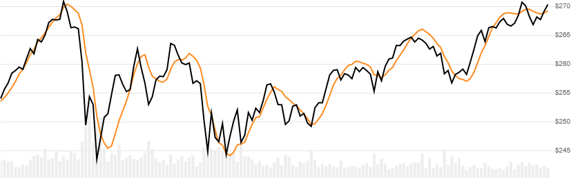

# Endpoint Moving Average (EPMA)

Endpoint Moving Average (EPMA), also known as Least Squares Moving Average (LSMA), plots the projected last point of a linear regression lookback window.
[[Discuss] :speech_balloon:](https://github.com/DaveSkender/Stock.Indicators/discussions/371 "Community discussion about this indicator")



```csharp
// usage
IEnumerable<EpmaResult> results =
  quotes.GetEpma(lookbackPeriods);  
```

## Parameters

| name | type | notes
| -- |-- |--
| `lookbackPeriods` | int | Number of periods (`N`) in the moving average.  Must be greater than 0.

### Historical quotes requirements

You must have at least `N` periods of `quotes`.

`quotes` is an `IEnumerable<TQuote>` collection of historical price quotes.  It should have a consistent frequency (day, hour, minute, etc).  See [the Guide](../../docs/GUIDE.md#historical-quotes) for more information.

## Response

```csharp
IEnumerable<EpmaResult>
```

- This method returns a time series of all available indicator values for the `quotes` provided.
- It always returns the same number of elements as there are in the historical quotes.
- It does not return a single incremental indicator value.
- The first `N-1` periods will have `null` values since there's not enough data to calculate.

### EpmaResult

| name | type | notes
| -- |-- |--
| `Date` | DateTime | Date
| `Epma` | decimal | Endpoint moving average

### Utilities

- [.Find(lookupDate)](../../docs/UTILITIES.md#find-indicator-result-by-date)
- [.RemoveWarmupPeriods()](../../docs/UTILITIES.md#remove-warmup-periods)
- [.RemoveWarmupPeriods(qty)](../../docs/UTILITIES.md#remove-warmup-periods)

See [Utilities and Helpers](../../docs/UTILITIES.md#utilities-for-indicator-results) for more information.

## Example

```csharp
// fetch historical quotes from your feed (your method)
IEnumerable<Quote> quotes = GetHistoryFromFeed("MSFT");

// calculate 20-period EPMA
IEnumerable<EpmaResult> results = quotes.GetEpma(20);
```
