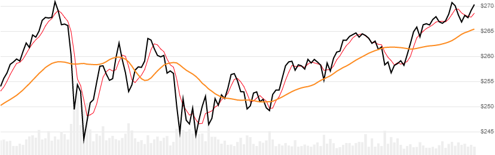

# Hilbert Transform Instantaneous Trendline

Created by John Ehlers, the Hilbert Transform Instantaneous Trendline is a 5-period trendline of high/low price that uses signal processing to reduce noise.
[[Discuss] :speech_balloon:](https://github.com/DaveSkender/Stock.Indicators/discussions/363 "Community discussion about this indicator")



```csharp
// usage
IEnumerable<HtlResult> results =
  quotes.GetHtTrendline();
```

## Historical quotes requirements

Since this indicator has a warmup period, you must have at least `100` periods of `quotes`.

`quotes` is an `IEnumerable<TQuote>` collection of historical price quotes.  It should have a consistent frequency (day, hour, minute, etc).  See [the Guide](../../docs/GUIDE.md#historical-quotes) for more information.

## Response

```csharp
IEnumerable<HtlResult>
```

- This method returns a time series of all available indicator values for the `quotes` provided.
- It always returns the same number of elements as there are in the historical quotes.
- It does not return a single incremental indicator value.
- The first `6` periods will have `null` values for `SmoothPrice` since there's not enough data to calculate.

:hourglass: **Convergence Warning**: The first `100` periods will have decreasing magnitude, convergence-related precision errors that can be as high as ~5% deviation in indicator values for earlier periods.

### HtlResult

| name | type | notes
| -- |-- |--
| `Date` | DateTime | Date
| `Trendline` | decimal | HT Trendline
| `SmoothPrice` | decimal | Weighted moving average of `(H+L)/2` price

### Utilities

- [.Find(lookupDate)](../../docs/UTILITIES.md#find-indicator-result-by-date)
- [.RemoveWarmupPeriods()](../../docs/UTILITIES.md#remove-warmup-periods)
- [.RemoveWarmupPeriods(qty)](../../docs/UTILITIES.md#remove-warmup-periods)

See [Utilities and Helpers](../../docs/UTILITIES.md#utilities-for-indicator-results) for more information.

## Example

```csharp
// fetch historical quotes from your feed (your method)
IEnumerable<Quote> quotes = GetHistoryFromFeed("MSFT");

// calculate HT Trendline
IEnumerable<HtlResult> results = quotes.GetHtTrendline();
```
