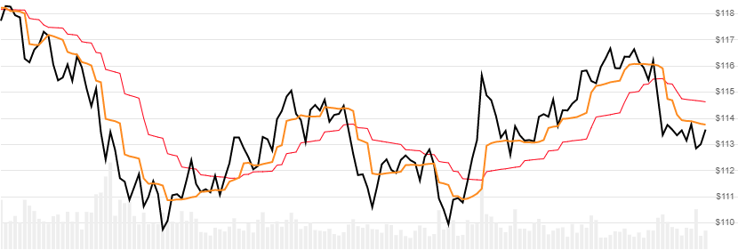

# MESA Adaptive Moving Average (MAMA)

Created by John Ehlers, the [MAMA](http://mesasoftware.com/papers/MAMA.pdf) indicator is a 5-period adaptive moving average of high/low price.
[[Discuss] :speech_balloon:](https://github.com/DaveSkender/Stock.Indicators/discussions/211 "Community discussion about this indicator")



```csharp
// usage
IEnumerable<MamaResult> results =
  quotes.GetMama(fastLimit, slowLimit);  
```

## Parameters

| name | type | notes
| -- |-- |--
| `fastLimit` | decimal | Fast limit threshold.  Must be greater than `slowLimit` and less than 1.  Default is 0.5.
| `slowLimit` | decimal | Slow limit threshold.  Must be greater than 0.  Default is 0.05.

### Historical quotes requirements

Since this indicator has a warmup period, you must have at least `50` periods of `quotes`.

`quotes` is an `IEnumerable<TQuote>` collection of historical price quotes.  It should have a consistent frequency (day, hour, minute, etc).  See [the Guide](../../docs/GUIDE.md#historical-quotes) for more information.

## Response

```csharp
IEnumerable<MamaResult>
```

- This method returns a time series of all available indicator values for the `quotes` provided.
- It always returns the same number of elements as there are in the historical quotes.
- It does not return a single incremental indicator value.
- The first `5` periods will have `null` values for `Mama` since there's not enough data to calculate.

:hourglass: **Convergence Warning**: The first `50` periods will have decreasing magnitude, convergence-related precision errors that can be as high as ~5% deviation in indicator values for earlier periods.

### MamaResult

| name | type | notes
| -- |-- |--
| `Date` | DateTime | Date
| `Mama` | decimal | MESA adaptive moving average (MAMA)
| `Fama` | decimal | Following adaptive moving average (FAMA)

### Utilities

- [.Find(lookupDate)](../../docs/UTILITIES.md#find-indicator-result-by-date)
- [.RemoveWarmupPeriods()](../../docs/UTILITIES.md#remove-warmup-periods)
- [.RemoveWarmupPeriods(qty)](../../docs/UTILITIES.md#remove-warmup-periods)

See [Utilities and Helpers](../../docs/UTILITIES.md#utilities-for-indicator-results) for more information.

## Example

```csharp
// fetch historical quotes from your feed (your method)
IEnumerable<Quote> quotes = GetHistoryFromFeed("MSFT");

// calculate Mama(0.5,0.05)
IEnumerable<MamaResult> results = quotes.GetMama(0.5,0.05);
```
